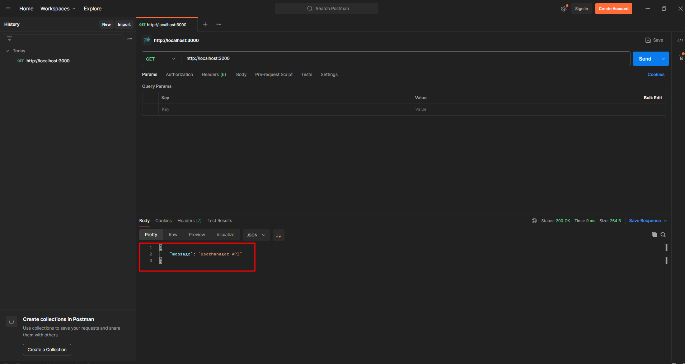
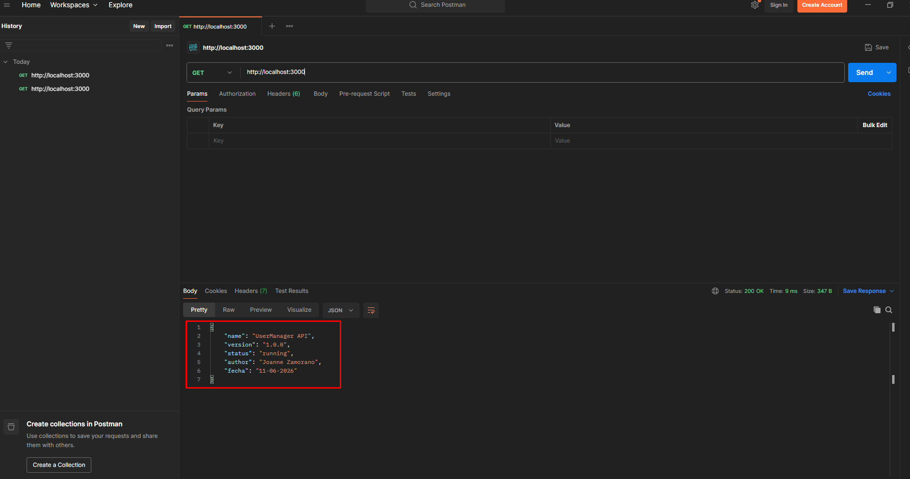
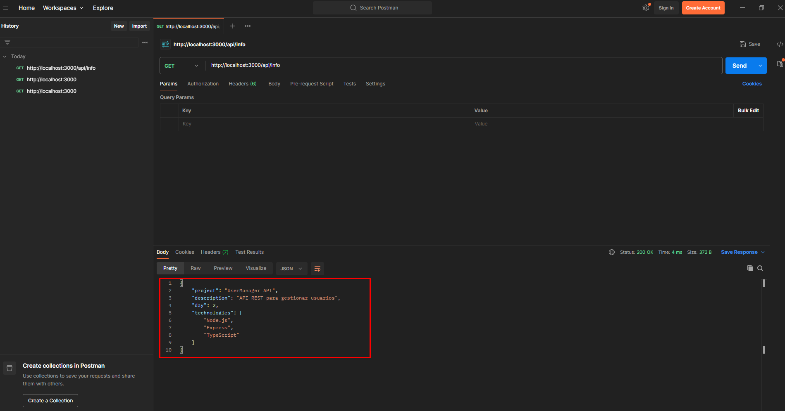
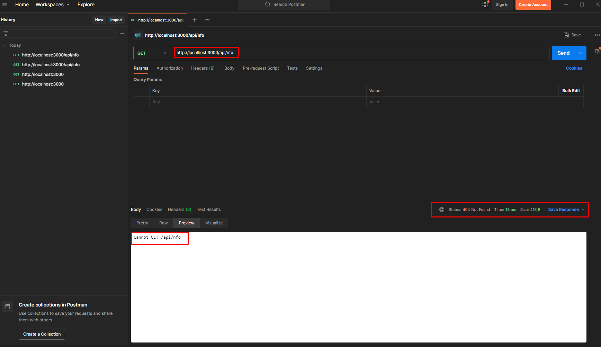

# Día 2: Preparación del proyecto

## Qué he hecho

- He inicializado el proyecto Node.js.
- He instalado Express.
- He configurado TypeScript.
- He creado la carpeta src.
- He creado el archivo src/server.ts.
- He arrancado el servidor en local.
- He probado la respuesta desde navegador o Thunder Client.

## Comando para arrancar el proyecto

```bash
npm run dev
```

## URL de prueba

```text
http://localhost:3000
```

## Respuesta obtenida

```json
{
  "message": "UserManager API"
}
```



---

## Parte libre
### Tarea libre 1: Personalizar el mensaje inicial
Modifica la respuesta de la ruta / para que devuelva algo más completo.


### Tarea libre 2: Añadir una segunda ruta temporal
Crea una ruta nueva:  GET /api/info
Esta ruta debe devolver información básica del proyecto.


## Tarea libre 3: Explicar el servidor con tus palabras
### ¿Qué hace el archivo src/server.ts?
Es el punto de entrada principal de nuestra API backend. Su función es configurar el servidor web (Express), definir las rutas (endpoints) a las que los clientes pueden llamar y poner la aplicación a escuchar peticiones en un puerto específico.

### ¿Qué hace app.listen?
Hace que nuestra aplicación se quede activa de forma indefinida, escuchando en un puerto concreto (en nuestro caso el `3000`) a la espera de que llegue alguna petición HTTP desde Postman, el navegador o el frontend.

### ¿Qué hace app.get?
Sirve para definir una ruta o endpoint que reacciona específicamente al método HTTP GET, que se utiliza para solicitar o leer información.

### ¿Por qué usamos express.json()?
Porque Node.js y Express no saben leer el texto plano que llega en el cuerpo (body) de las peticiones cuando se envía información en formato JSON. 
Esta línea 
1. Intercepta la petición
2. Transforma ese JSON en un objeto de JavaScript 
3. Lo deja listo para que podamos usarlo con `req.body`

## Tarea libre 4: Investigar un error
Provoca intencionadamente un pequeño error, por ejemplo:
 - Escribir mal una ruta.

* **Qué error apareció:** En Postman apareció un error con código de estado **`404 Not Found`** y el mensaje en pantalla **`Cannot GET /api/info`**. 
* **Qué crees que significaba:** El servidor está funcionando perfectamente, pero cuando el cliente (Postman) llamó a la dirección `/api/nfo`, Express miró en su lista de rutas registradas y no encontró ninguna que coincidiera exactamente con esa URL y ese método GET.
* **Cómo lo solucionaste:** Escribí correctamente la ruta.


