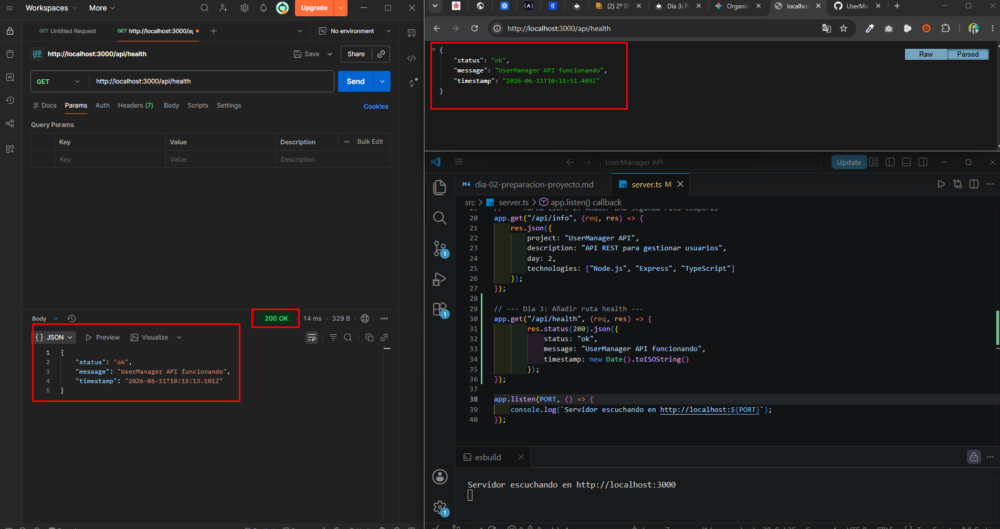
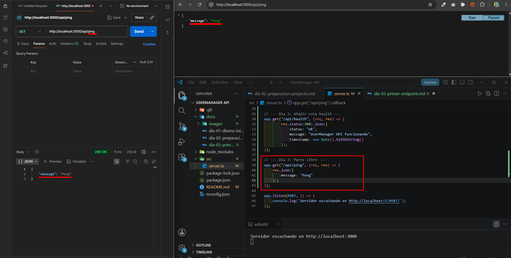
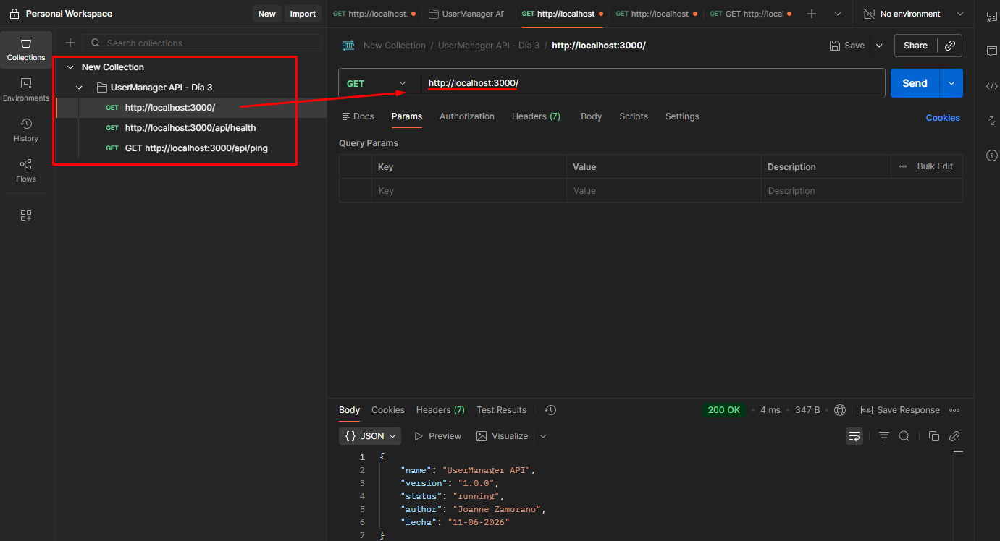
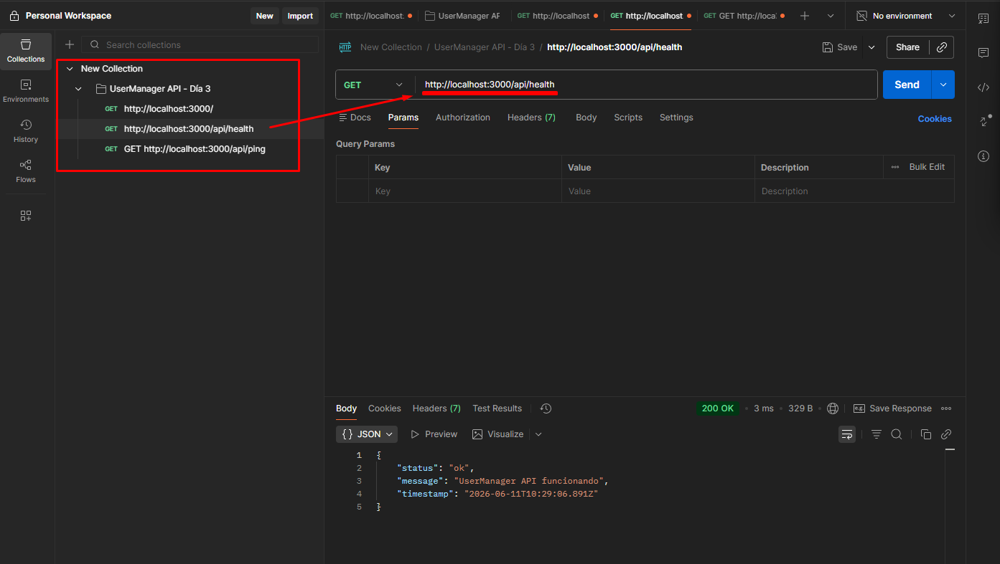
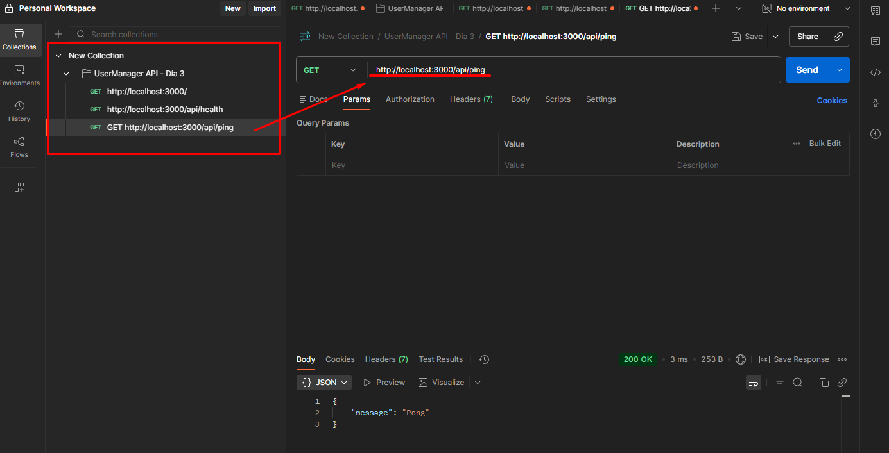

# Día 3: Primer endpoint

## Qué he hecho

- He creado el endpoint `GET /api/health`.
- He devuelto una respuesta JSON.
- He usado el status code `200`.
- He probado la ruta desde navegador.
- He probado la ruta desde Thunder Client o Postman.
- He probado una ruta incorrecta para comprobar qué ocurre.

## Endpoint creado

```http
GET /api/health
```

## Respuesta obtenida

```json
{
  "status": "ok",
  "message": "UserManager API funcionando",
  "timestamp": "..."
}
```



## Explicación personal

El endpoint `/api/health` sirve para comprobar que la API está funcionando correctamente. Cuando recibe una petición `GET`, devuelve un JSON con el estado de la aplicación.

## Parte libre

### Tarea libre 2: Crear un endpoint /api/ping
Crea una nueva ruta: GET /api/ping
Debe devolver una respuesta sencilla:
```json
{
  "message": "pong"
}
```
Este tipo de ruta se usa a veces para comprobar que un servidor responde rápidamente.



### Tarea libre 3: Comparar /, /api/health y /api/ping
| Ruta | Método | Para qué sirve |
| :--- | :---: | :--- |
| `/` | `GET` | Mensaje inicial de la API |
| `/api/health` | `GET` | Comprobar el estado de la API |
| `/api/ping` | `GET` | Comprobar respuesta rápida del servidor |

### Tarea libre 4: Crear una pequeña colección de pruebas
| Petición | Código esperado | Resultado obtenido |
| :--- | :---: | :--- |
| `GET /` | 200 | `{ "name": "UserManager API", "version": "1.0.0", "status": "running", "author": "Joanne Zamorano", "fecha": "11-06-2026" }` |
| `GET /api/health` | 200 | `{ "status": "ok", "message": "UserManager API funcionando", "timestamp": "2026-06-11T10:29:06.891Z" }` |
| `GET /api/ping` | 200 | `{ "message": "Pong" }` |



