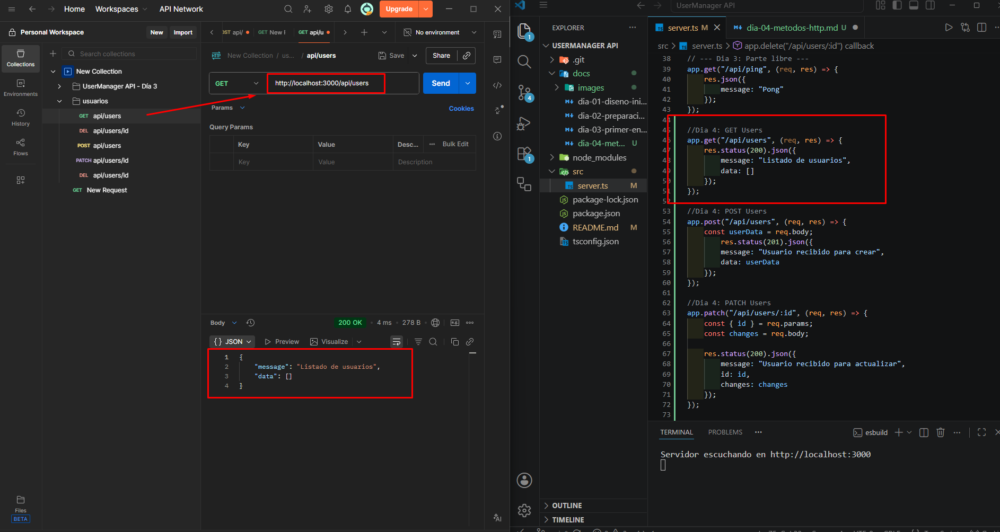
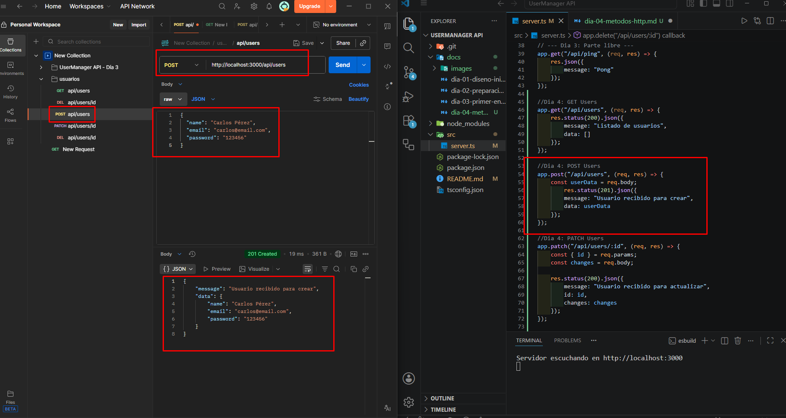
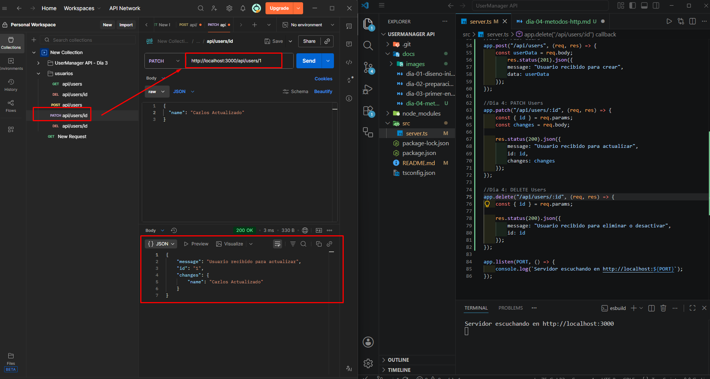
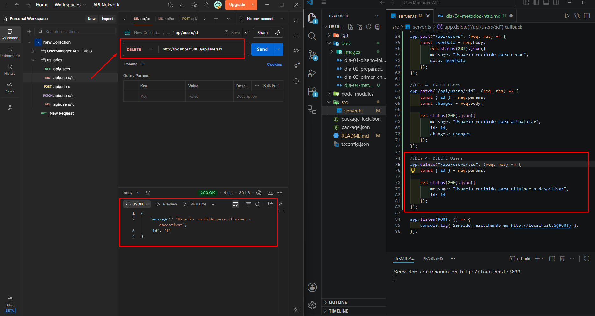

# Día 4: Métodos HTTP

## Qué he hecho

- He creado rutas simuladas para usuarios.
- He probado `GET /api/users`.
- He probado `GET /api/users/:id`.
- He probado `POST /api/users` enviando JSON.
- He probado `PATCH /api/users/:id` enviando JSON.
- He probado `DELETE /api/users/:id`.
- He creado una colección de pruebas en Thunder Client o Postman.

## Endpoints trabajados

```http
GET /api/users
GET /api/users/:id
POST /api/users
PATCH /api/users/:id
DELETE /api/users/:id
```

## Explicación personal

* GET sirve para obtener información.
* POST sirve para crear información.
* PATCH sirve para modificar parte de un recurso.
* DELETE sirve para eliminar o desactivar un recurso.

## Pruebas realizadas
GET:


POST:


PATCH:


DELETE:
