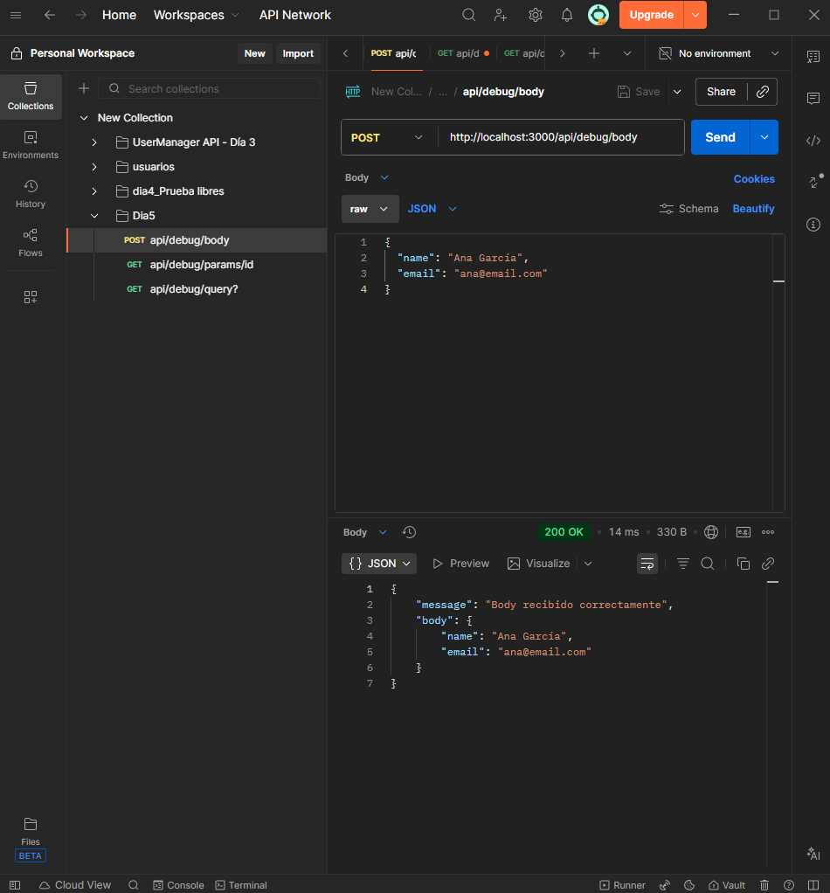
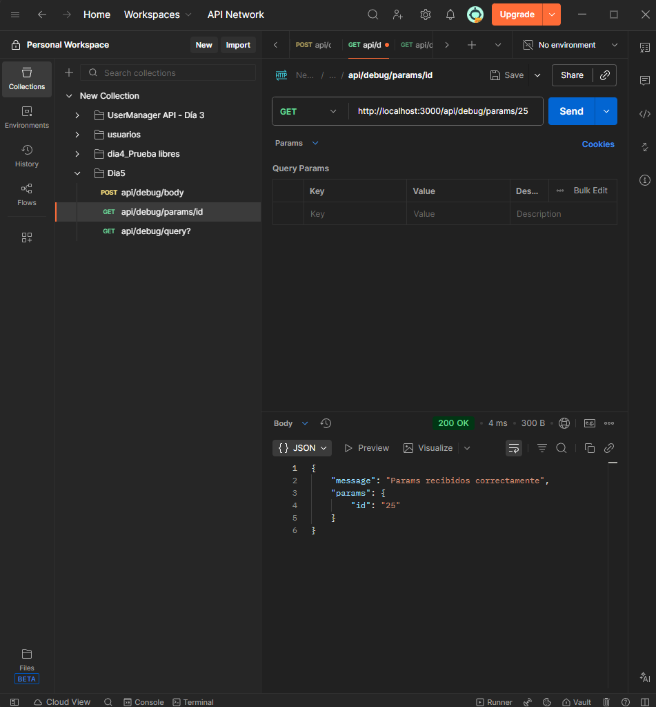
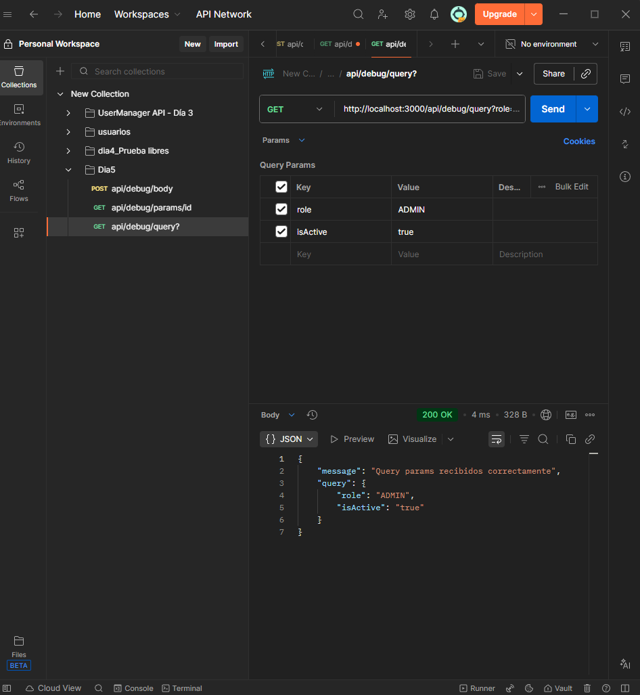
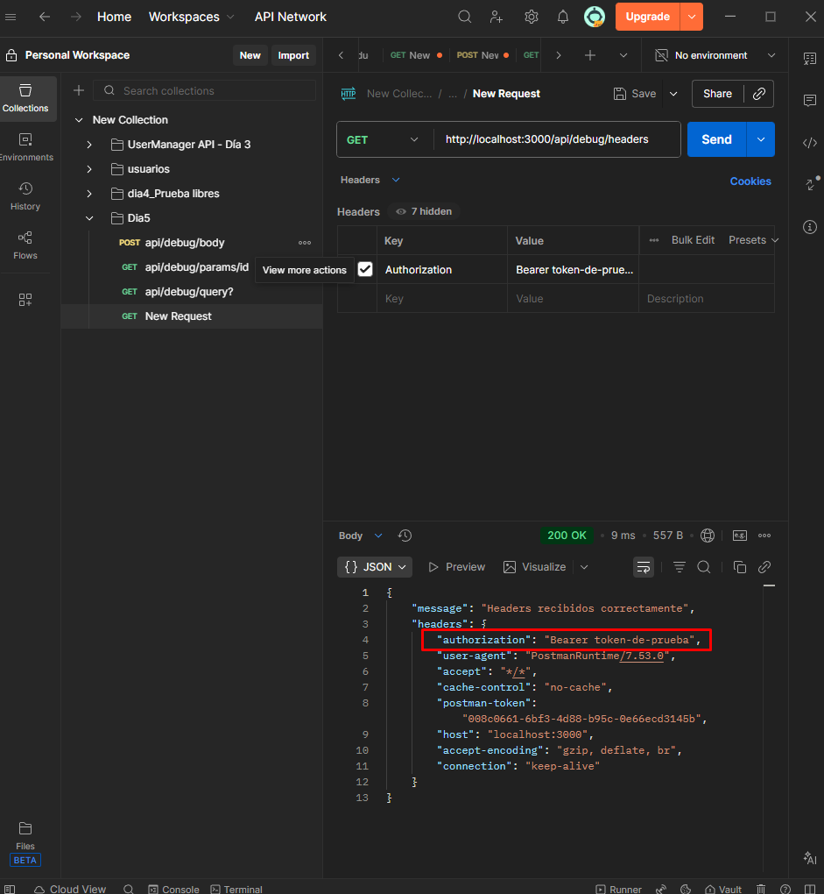
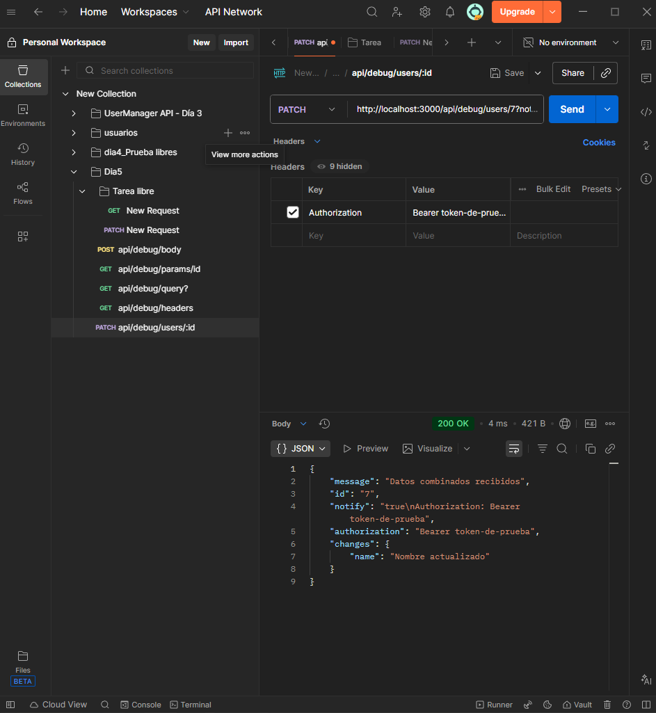
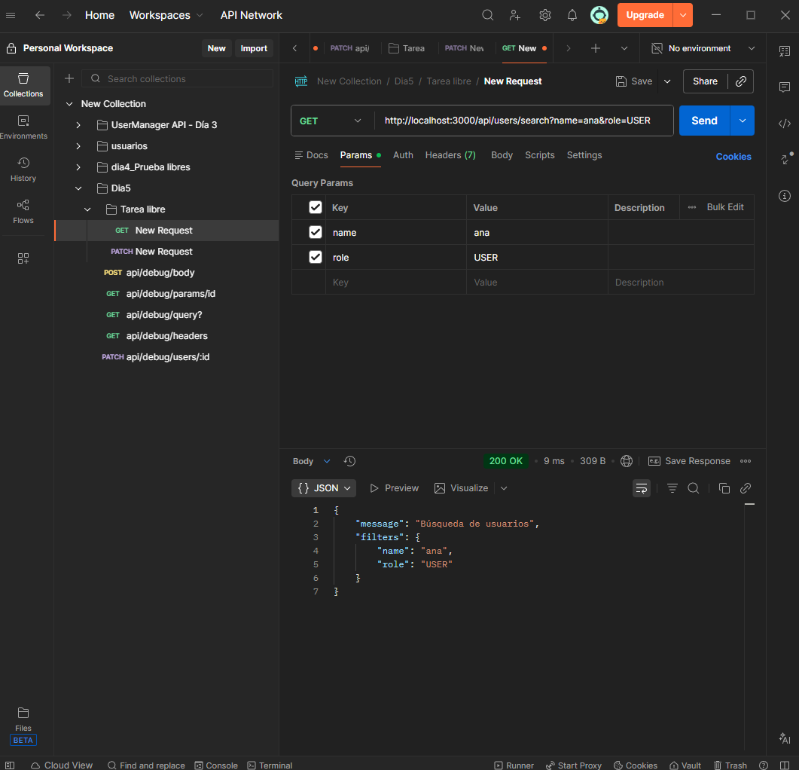
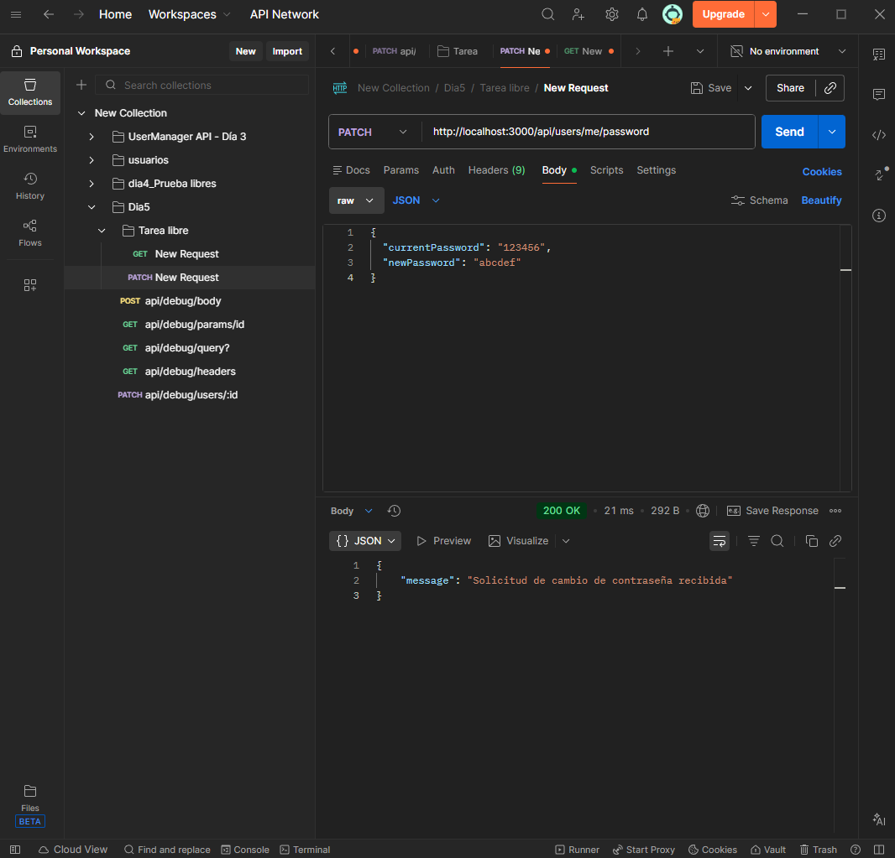
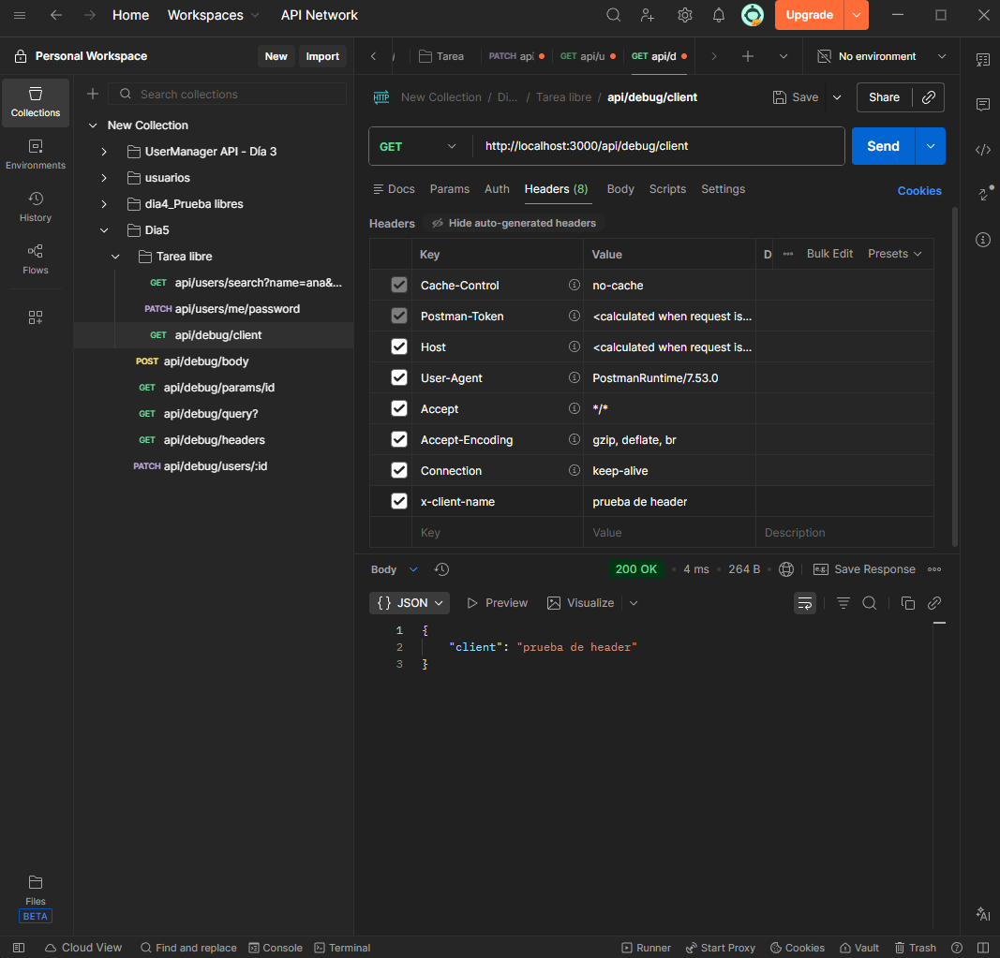

# Día 5: JSON, body, params y headers

## Qué he hecho

- He repasado qué es JSON.
- He aprendido para qué sirve el body.
- He probado route params.
- He probado query params.
- He probado headers.
- He creado rutas temporales de debug.
- He creado una colección de pruebas en Thunder Client o Postman.

## Rutas trabajadas

```http
POST /api/debug/body
GET /api/debug/params/:id
GET /api/debug/query
GET /api/debug/headers
PATCH /api/debug/users/:id
```

## Explicación personal

* El body sirve para enviar datos principales al servidor.
* Los params sirven para identificar recursos concretos en la ruta.
* Los query params sirven para enviar filtros u opciones en la URL.
* Los headers sirven para enviar información adicional de la petición.


## Pruebas realizadas

### Petición: POST /api/debug/body

* Dato probado: Body
* Codigo esperado: 200
* Resultado obtenido:



### Petición: GET /api/debug/params/25

* Dato probado: Params
* Codigo esperado: 200
* Resultado obtenido:



### Petición: GET /api/debug/query?role=ADMIN&isActive=true

* Dato probado: Query params
* Codigo esperado: 200
* Resultado obtenido:



### Petición: GET /api/debug/headers

* Dato probado: Headers
* Codigo esperado: 200
* Resultado obtenido:



### Petición: PATCH /api/debug/users/7?notify=true

* Dato probado: Combinado
* Codigo esperado: 200
* Resultado obtenido:



## Tareas Libres

* Tarea libre 1: Crear una ruta de búsqueda simulada


* Tarea libre 2: Crear una ruta de cambio de contraseña simulada


* Tarea libre 3: Leer un header personalizado
