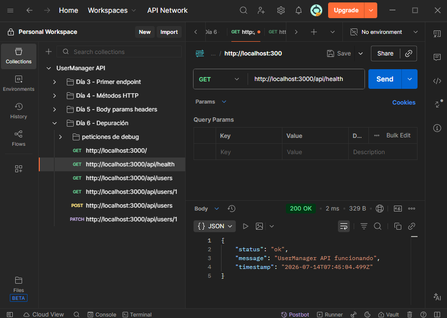
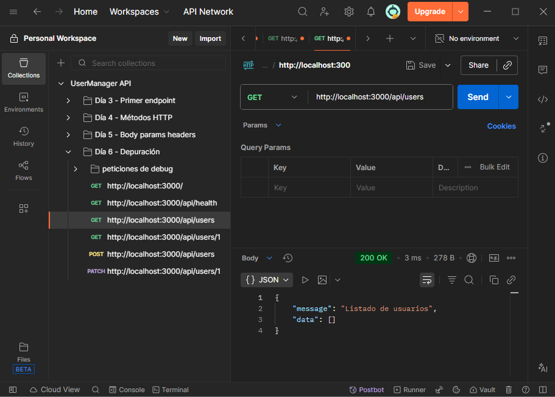
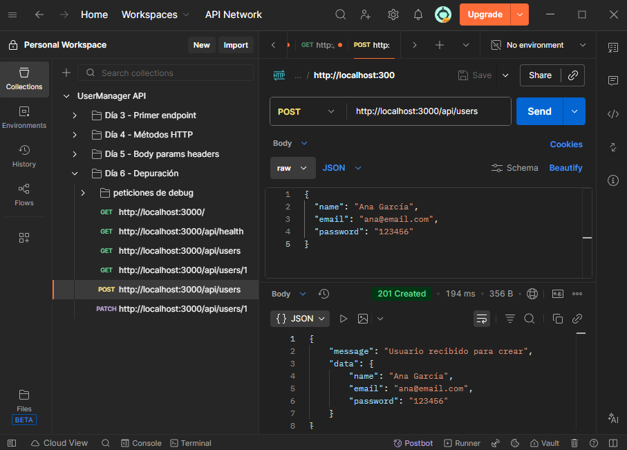
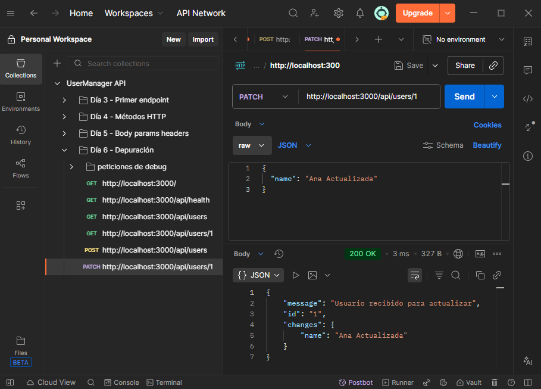
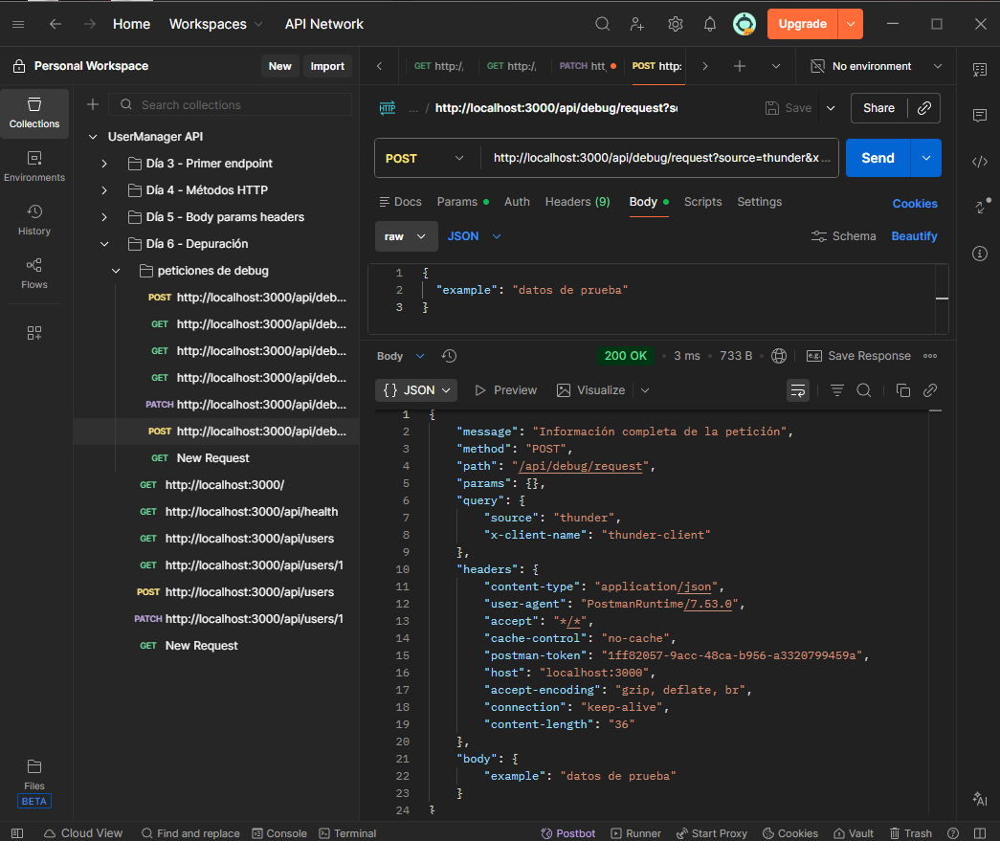
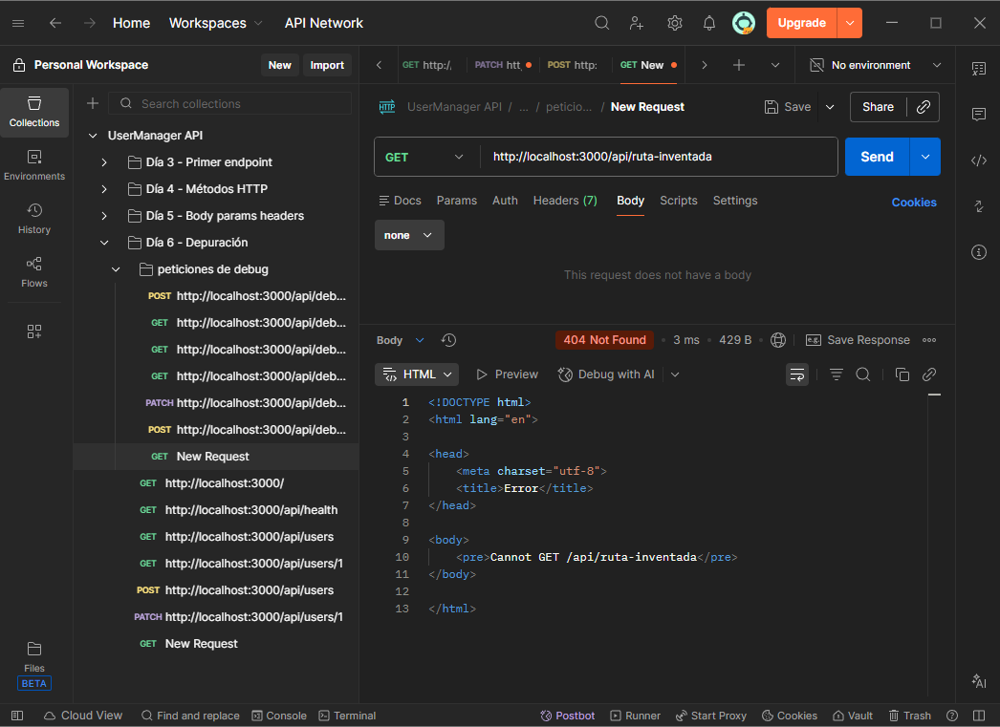
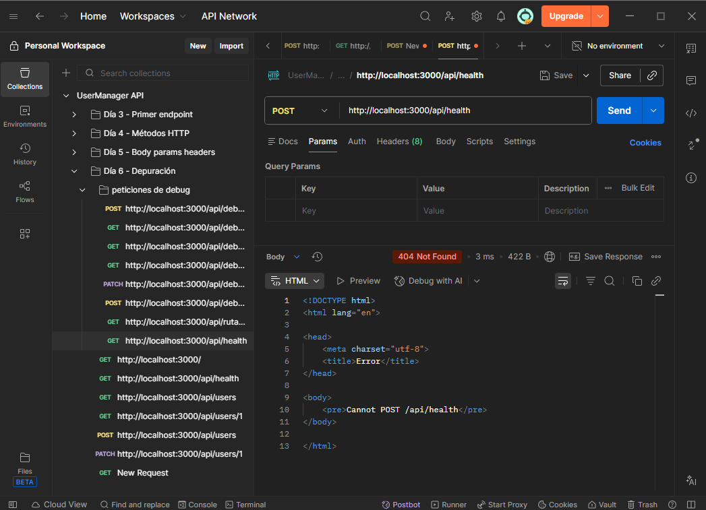
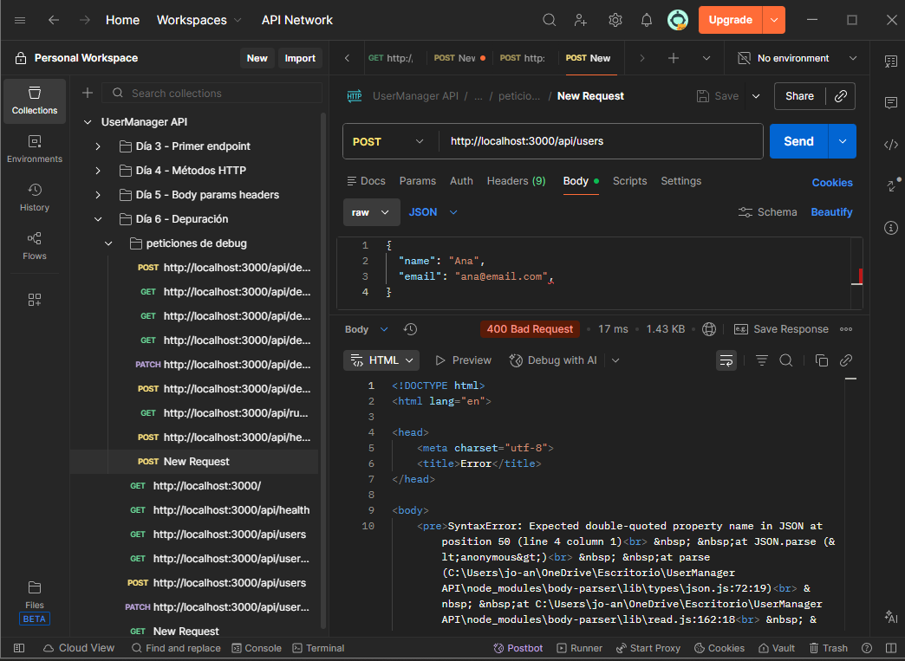

# Día 6: Cliente HTTP y depuración

## Qué he hecho

- He organizado una colección de pruebas de la API.
- He probado rutas básicas.
- He probado peticiones con body.
- He probado peticiones con params, query params y headers.
- He creado una ruta temporal de depuración.
- He provocado errores controlados para entender qué ocurre.
- He revisado respuestas y códigos de estado.

## Colección creada

Nombre de la colección:

```text
UserManager API
```

## Ruta temporal de depuración

```http
POST /api/debug/request
```

## Explicación personal

Un cliente HTTP sirve para enviar peticiones a una API y analizar las
respuestas. Es útil porque permite probar métodos, headers, body, params y
códigos de estado de una forma más completa que el navegador.


| Petición | Qué prueba | Código esperado | Código obtenido | Observaciones |
| :--- | :--- | :---: | :---: | :--- |
| `GET /api/health` | Health endpoint | 200 | 200 |  |
| `GET /api/users` | Listado simulado | 200 | 200 |  |
| `POST /api/users` | Body JSON | 201 | 201 |  |
| `PATCH /api/users/1` | Params + body | 200 | 200 |  |
| `POST /api/debug/request?source=thunder` | Request completa | 200 | 200 |  |
| `GET /api/ruta-inventada` | Ruta inexistente | 404 | 404 |  |
| `POST /api/health` | Método incorrecto | 404 | 404 |  |
| `POST /api/users` | JSON mal formado | 400 | 400 |  |