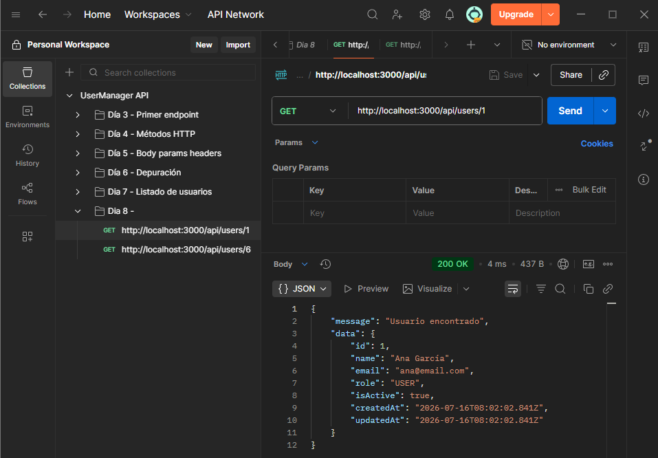
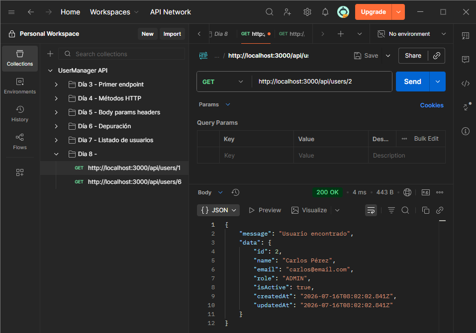
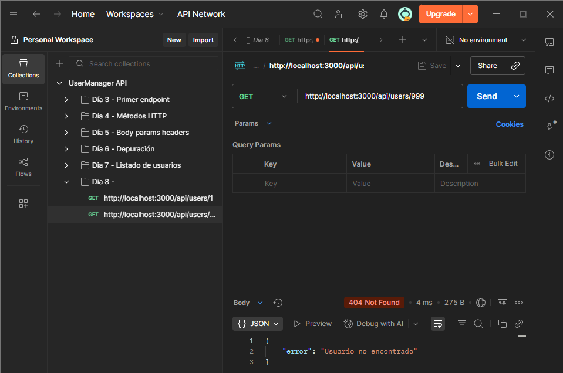
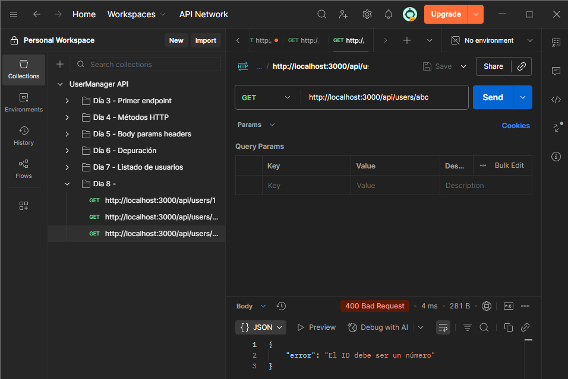

# Día 8: Consultar usuario por ID

## Qué he hecho

- He actualizado el endpoint `GET /api/users/:id`.
- He leído el ID desde `req.params`.
- He convertido el ID de string a number.
- He validado si el ID es numérico.
- He buscado usuarios con `find`.
- He devuelto `404` cuando el usuario no existe.
- He probado diferentes casos desde Thunder Client o Postman.

## Endpoint trabajado

```http
GET /api/users/:id
```

## Casos probados

| Petición | Código esperado | Resultado |
| --- | ---: | --- |
| `GET /api/users/1` | 200 |  |
| `GET /api/users/2` | 200 |  |
| `GET /api/users/999` | 404 |  |
| `GET /api/users/abc` | 400 |  |

## Explicación personal

El parámetro `:id` se recibe desde `req.params`. Como llega en formato string,
hay que convertirlo a number antes de compararlo con los id de los usuarios.
