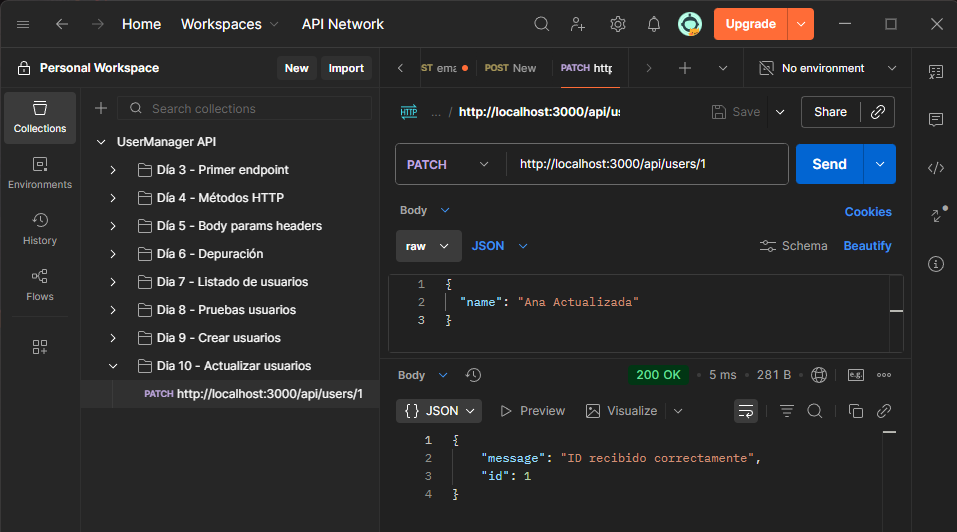
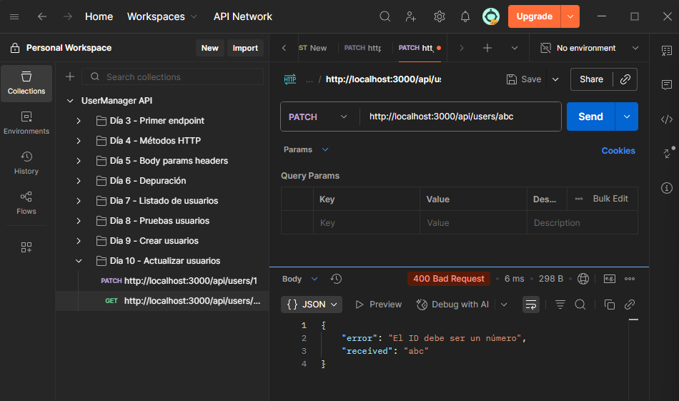
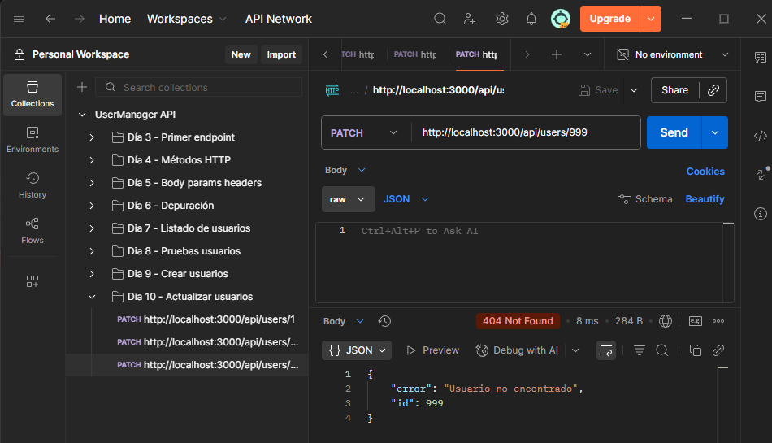
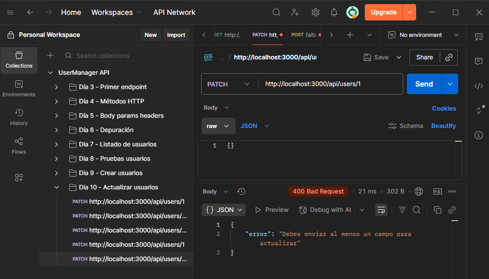
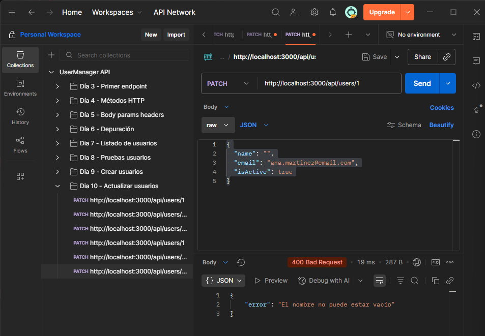
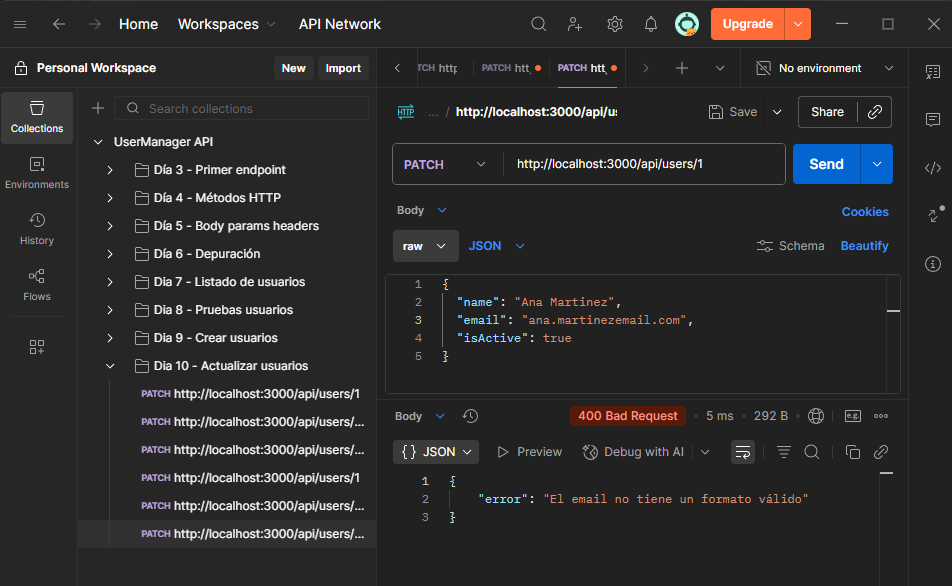
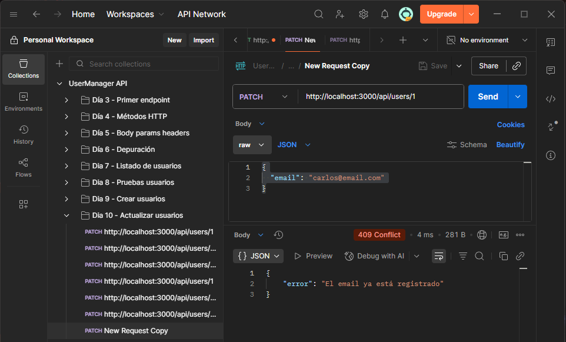
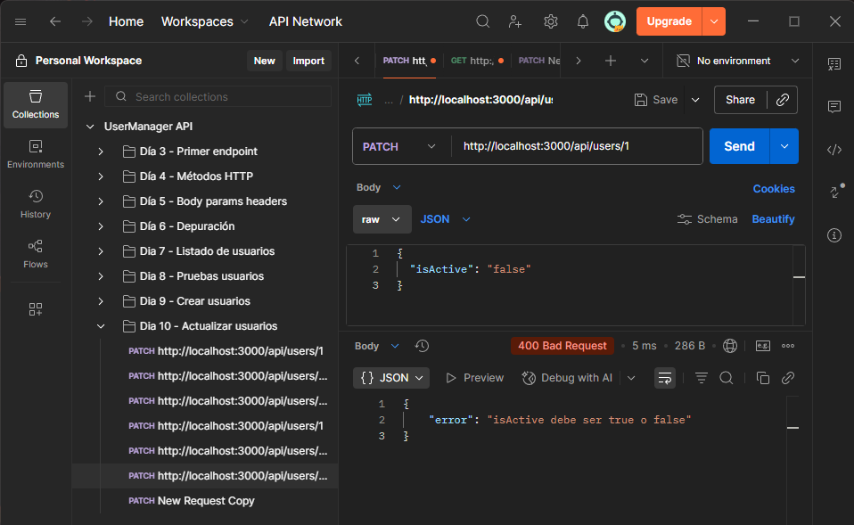
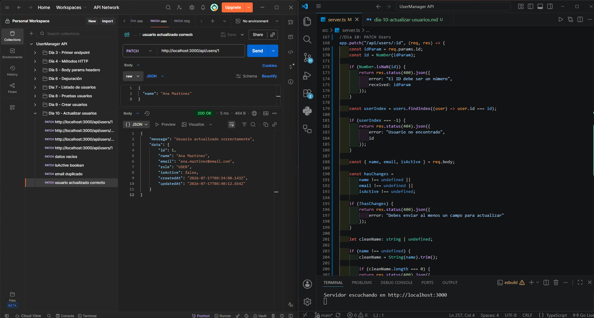

# Día 10: Actualizar usuarios en memoria

## Qué he hecho

- He actualizado el endpoint `PATCH /api/users/:id`.
- He leído el ID desde `req.params`.
- He leído los cambios desde `req.body`.
- He validado que el ID sea numérico.
- He comprobado si el usuario existe.
- He validado que el body no esté vacío.
- He validado `name`, `email` e `isActive`.
- He comprobado email duplicado al actualizar.
- He actualizado `updatedAt`.
- He sustituido el usuario dentro del array.

## Endpoint trabajado

```http
PATCH /api/users/:id
```

## Body de ejemplo

```json
{
  "name": "Ana Martínez"
}
```

## Casos probados

| Caso | Código esperado | Resultado |
| --- | ---: | --- |
| Actualización correcta | 200 |  |
| ID no válido | 400 |  |
| Usuario inexistente | 404 |  |
| Body vacío | 400 |  |
| Nombre vacío | 400 |  |
| Email inválido | 400 |  |
| Email duplicado | 409 |  |
| `isActive` incorrecto | 400 |  |



## Explicación personal

Para actualizar un usuario se lee el ID desde `req.params`, se busca el usuario en el array, se leen los cambios desde `req.body` y se sustituyen solo los campos que han llegado en la petición.