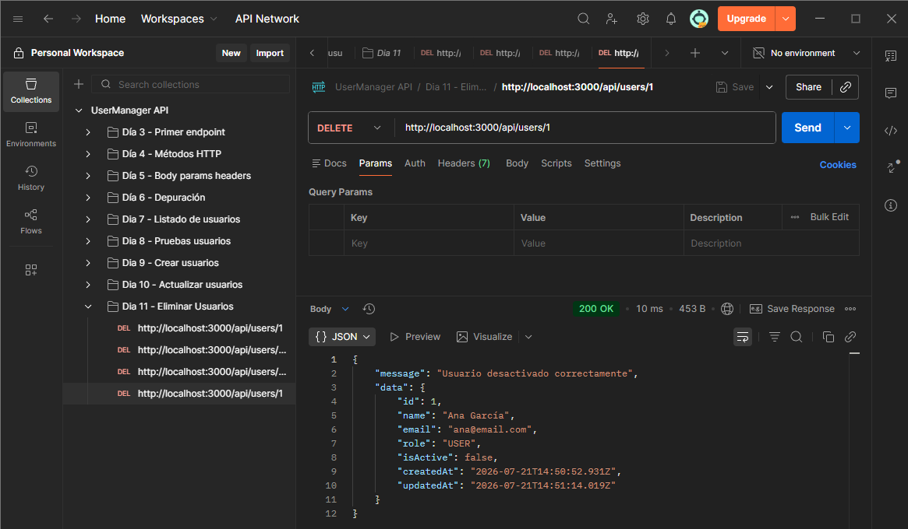
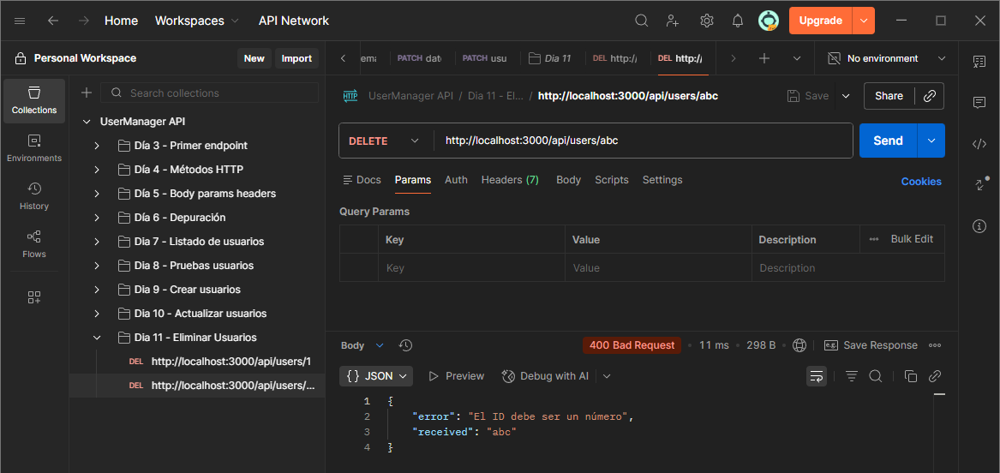
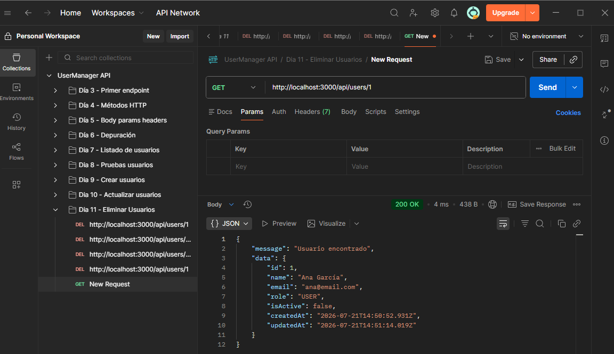
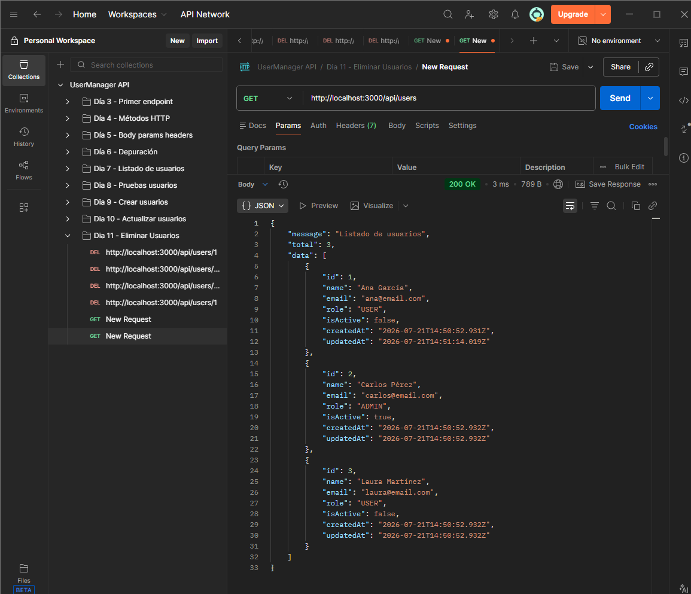

# Día 11 - Eliminar o desactivar usuarios en memoria

## Qué he hecho

- He actualizado el endpoint `DELETE /api/users/:id`.
- He leído el ID desde `req.params`.
- He validado que el ID sea numérico.
- He comprobado si el usuario existe.
- He aplicado borrado lógico usando `isActive = false`.
- He actualizado `updatedAt`.
- He comprobado que el usuario sigue existiendo en el listado.
- He probado casos de error.

## Endpoint trabajado

```http
DELETE /api/users/:id
```

## Casos probados

| Caso | Código esperado | Resultado |
| --- | ---: | --- |
| Desactivar usuario existente | 200 |  |
| ID no válido | 400 |  |
| Usuario inexistente | 404 |  |
| Consultar usuario desactivado | 200 |  |
| Consultar listado después de desactivar | 200 |  |


## Explicación personal

En este proyecto `DELETE` no borra físicamente el usuario. En lugar de
eliminarlo del array, lo marcamos como inactivo cambiando `isActive` a `false`.
Esto se llama borrado lógico.