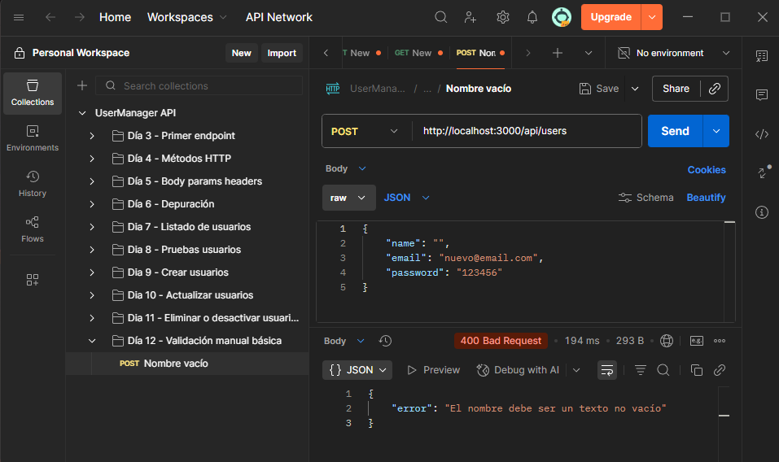
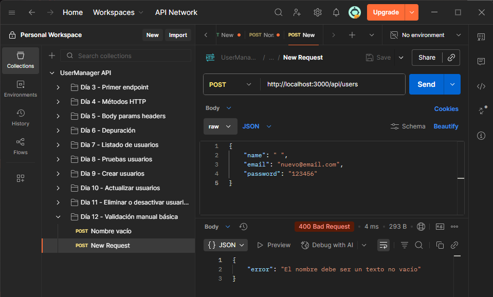
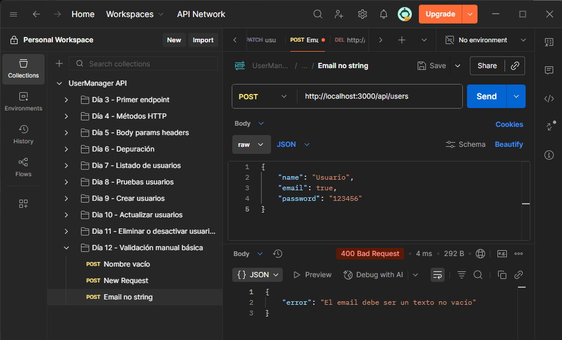
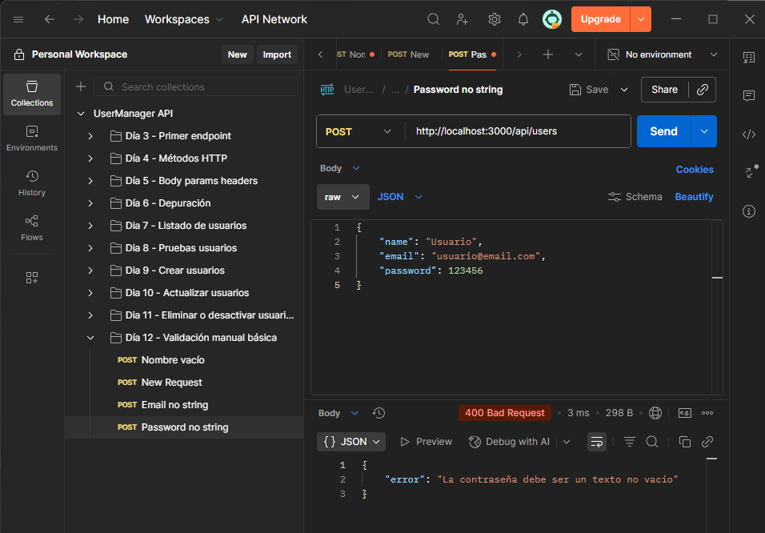
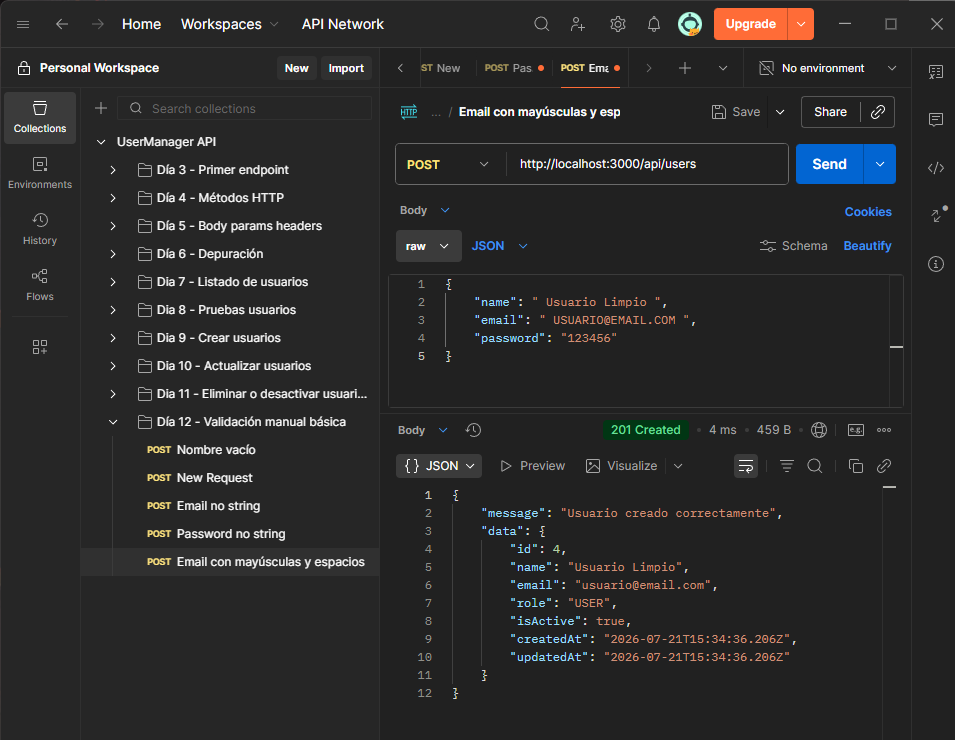
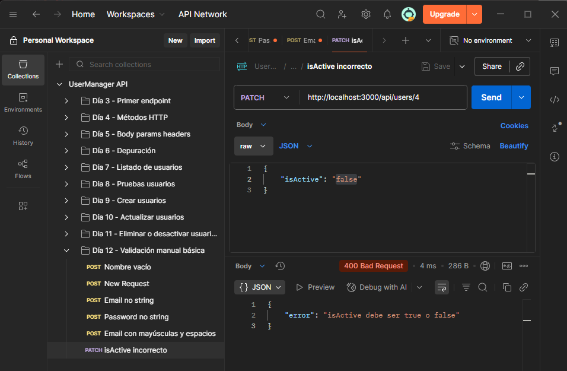

# Día 12 - Validación manual básica

## Qué he hecho

- He revisado las validaciones existentes.
- He creado funciones auxiliares de validación.
- He validado strings no vacíos.
- He validado tipos de datos.
- He limpiado `name` y `email` con `trim`.
- He normalizado `email` a minúsculas.
- He mejorado la validación de creación de usuarios.
- He mejorado la validación de actualización de usuarios.
- He probado errores `400 Bad Request`.

## Funciones creadas

```ts
function isNonEmptyString(value: unknown): value is string {
  return typeof value === "string" && value.trim().length > 0;
}

function isBoolean(value: unknown): value is boolean {
  return typeof value === "boolean";
}
```

## Casos probados

| Caso | Código esperado | Resultado |
| --- | ---: | --- |
| Nombre vacío | 400 |  |
| Nombre con solo espacios | 400 |  |
| Email no string | 400 |  |
| Password no string | 400 |  |
| Email con mayúsculas y espacios | 201 |  |
| isActive incorrecto en PATCH | 400 |  |

## Explicación personal

Validar datos significa comprobar que lo que llega a la API tiene el formato
esperado antes de usarlo. Si los datos son incorrectos, la API debe responder
con un error claro y no continuar con la operación.