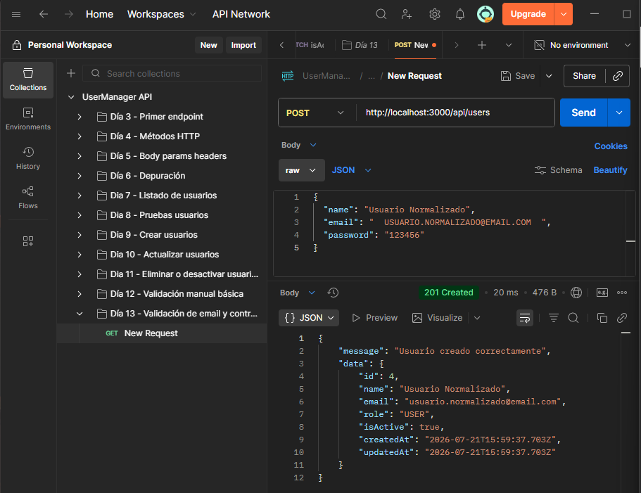
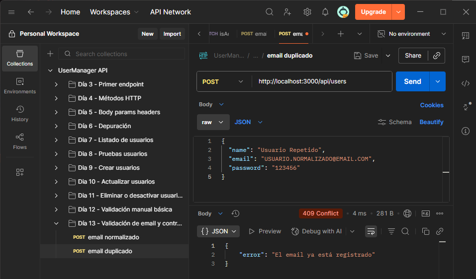

# Día 13 - Validación de email y control de duplicados

## Qué he hecho

- He creado una función para normalizar emails.
- He creado una función para validar emails de forma básica.
- He creado una función para comprobar si un email ya está registrado.
- He mejorado la creación de usuarios.
- He mejorado la actualización de usuarios.
- He comprobado duplicados en `POST /api/users`.
- He comprobado duplicados en `PATCH /api/users/:id`.
- He probado errores `400` y `409`.

## Funciones creadas

```ts
function normalizeEmail(email: string): string {
  return email.trim().toLowerCase();
}

function isValidBasicEmail(value: string): boolean {
  return value.includes("@") && value.includes(".");
}

function isEmailTaken(email: string, userIdToIgnore?: number): boolean {
  const normalizedEmail = normalizeEmail(email);

  return users.some(
    (user) => user.email === normalizedEmail && user.id !== userIdToIgnore
  );
}
```

## Casos probados

| Caso | Código esperado | Resultado |
| --- | ---: | --- |
| Crear usuario con email normalizado | 201 |  |
| Crear usuario con email duplicado | 409 |  |
| Crear usuario con email sin @ | 400 |  |
| Crear usuario con email sin punto | 400 |  |
| Actualizar usuario con su mismo email | 200 |  |
| Actualizar usuario con email de otro usuario | 409 |  |

## Explicación personal

Normalizar un email significa limpiarlo antes de guardarlo o compararlo. En este
proyecto usamos `trim` y `toLowerCase` para evitar duplicados provocados por
espacios o mayúsculas.