# Día 14 - Códigos de estado HTTP

## Qué he hecho

- He revisado los códigos HTTP utilizados en la API.
- He probado respuestas correctas con `200 OK`.
- He probado creación con `201 Created`.
- He probado errores de validación con `400 Bad Request`.
- He probado usuario inexistente con `404 Not Found`.
- He probado email duplicado con `409 Conflict`.
- He comprobado que el código HTTP coincide con el mensaje JSON.

## Tabla resumen

| Código | Significado | Cuándo lo uso |
| ---: | --- | --- |
| 200 | OK | Cuando la petición se procesa correctamente |
| 201 | Created | Cuando se crea un usuario |
| 400 | Bad Request | Cuando la petición tiene datos incorrectos |
| 404 | Not Found | Cuando el usuario no existe |
| 409 | Conflict | Cuando el email ya está registrado |

## Casos probados

| Petición | Caso | Código esperado | Código obtenido | ¿Correcto? |
| --- | --- | ---: | ---: | --- |
| `GET /api/health` | Health | 200 | 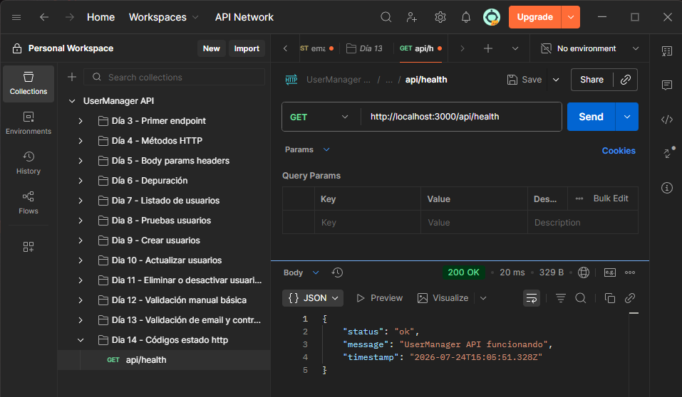 | SI |
| `GET /api/users` | Listado | 200 | 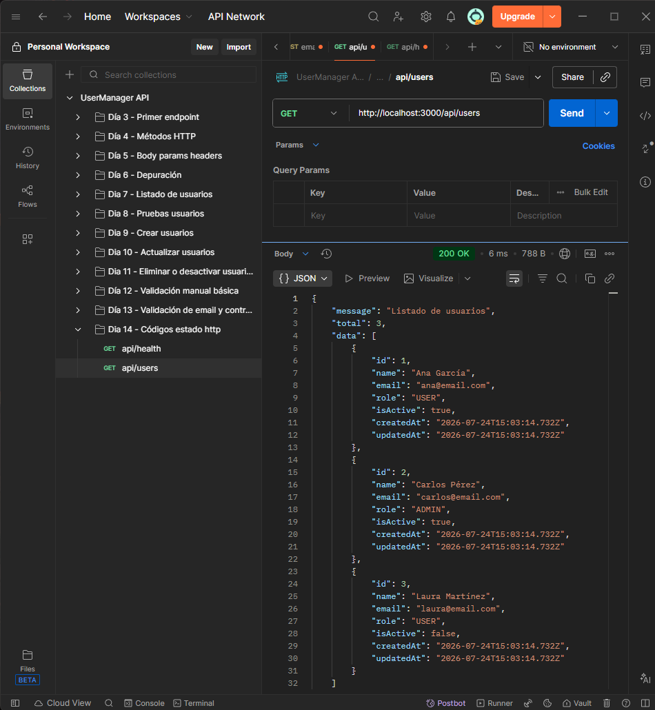 | SI |
| `GET /api/users/1` | Usuario existente | 200 | 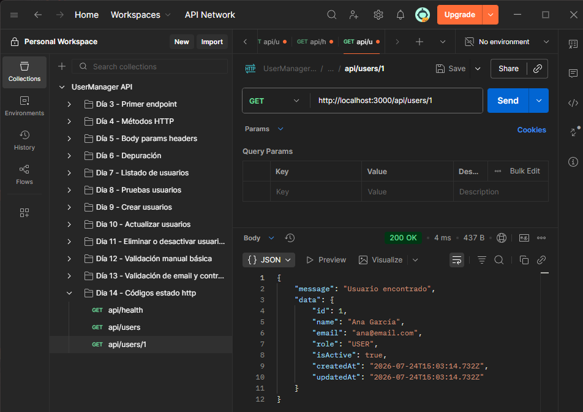 | SI |
| `GET /api/users/999` | Usuario inexistente | 404 | 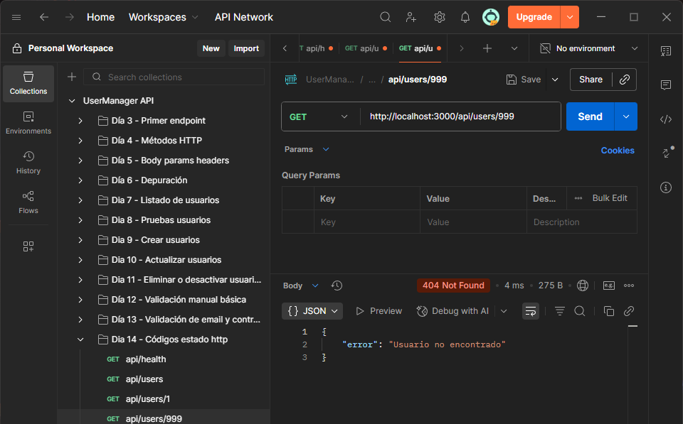 | SI |
| `GET /api/users/abc` | ID inválido | 400 | 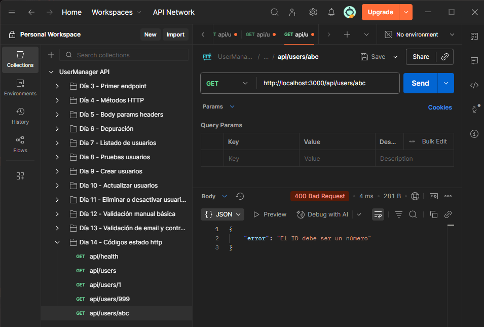 | SI |
| `POST /api/users` | Creación correcta | 201 | 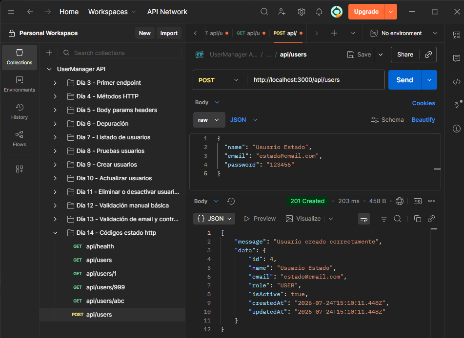 | SI |
| `POST /api/users` | Datos inválidos | 400 | 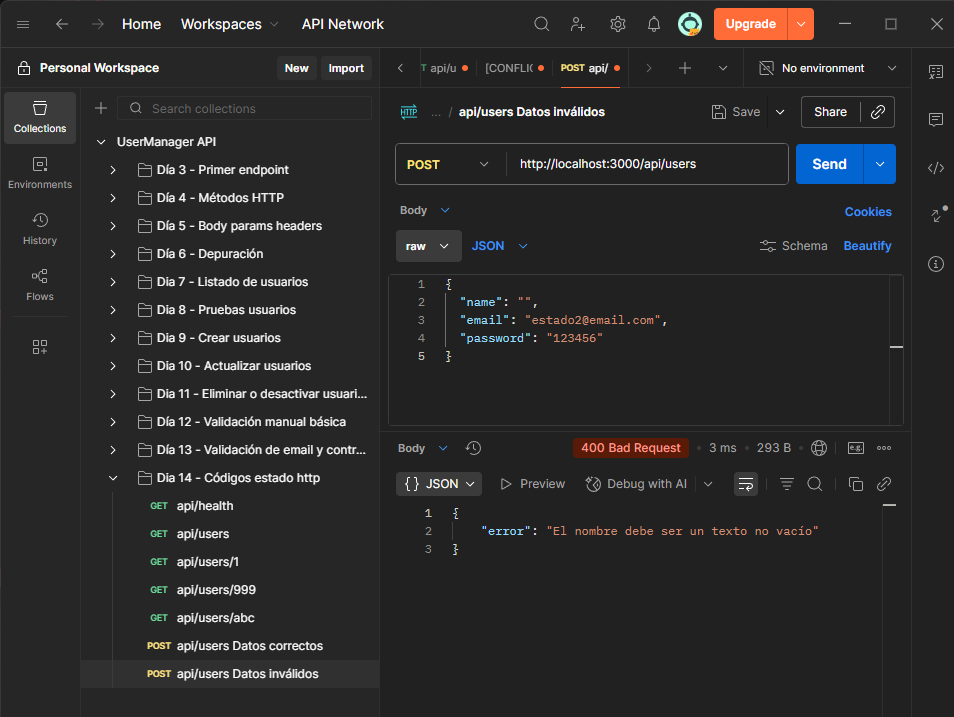 | SI |
| `POST /api/users` | Email duplicado | 409 | 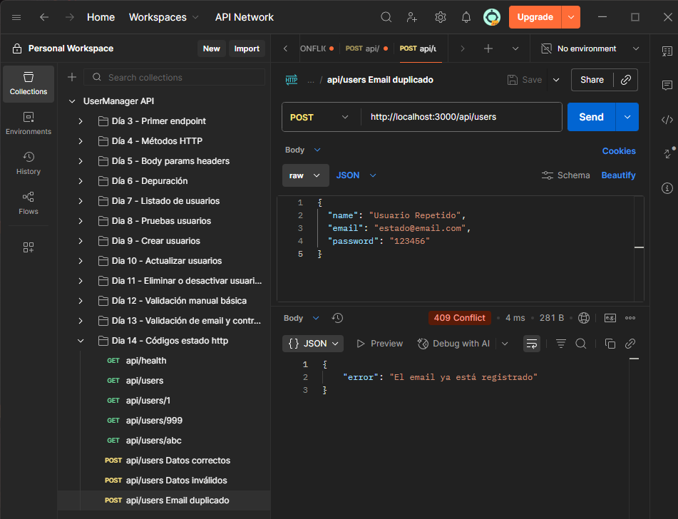 | SI |
| `PATCH /api/users/1` | Actualización correcta | 200 | 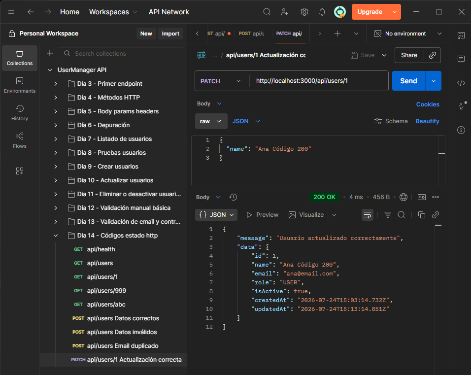 | SI |
| `PATCH /api/users/999` | Usuario inexistente | 404 | 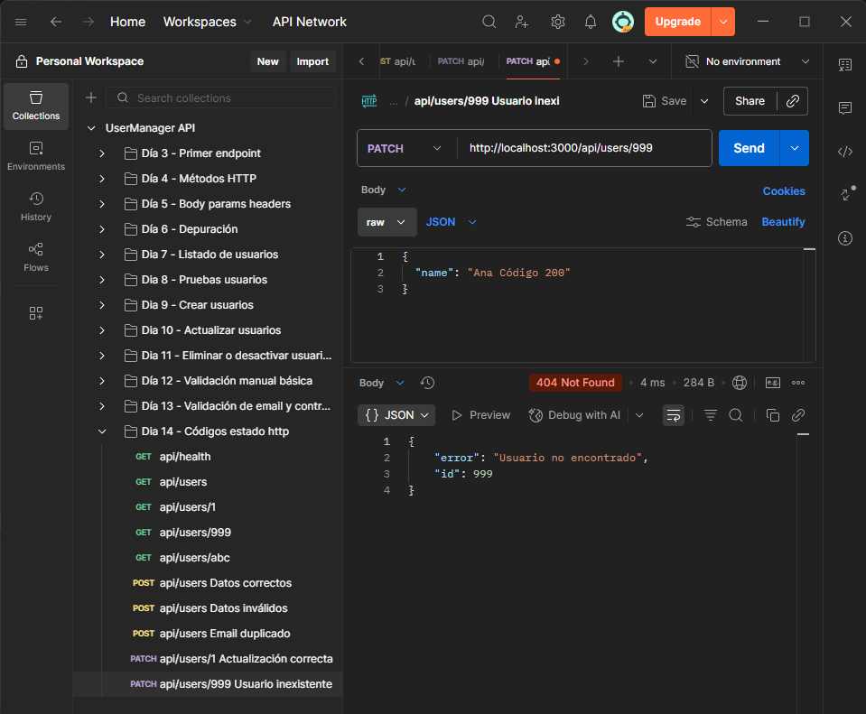 |  SI |
| `DELETE /api/users/1` | Desactivación correcta | 200 | 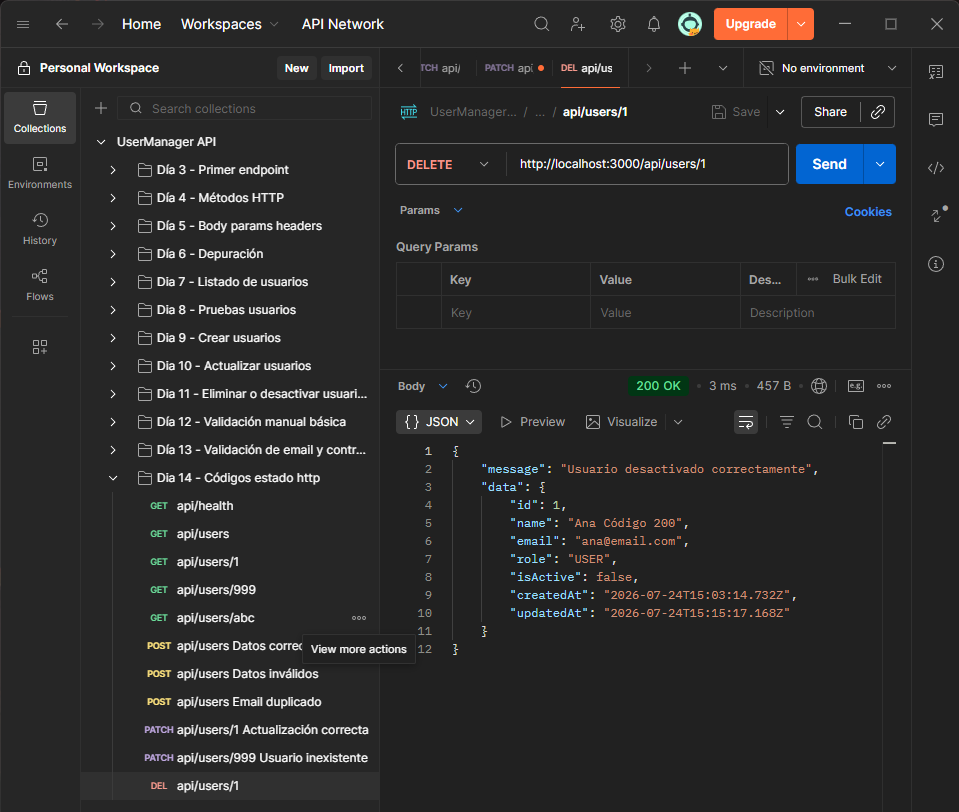 | SI |

## Explicación personal

Los códigos de estado HTTP permiten que el cliente entienda rápidamente qué ha
pasado con una petición. No basta con devolver un JSON; el código HTTP también
debe ser coherente con el resultado.