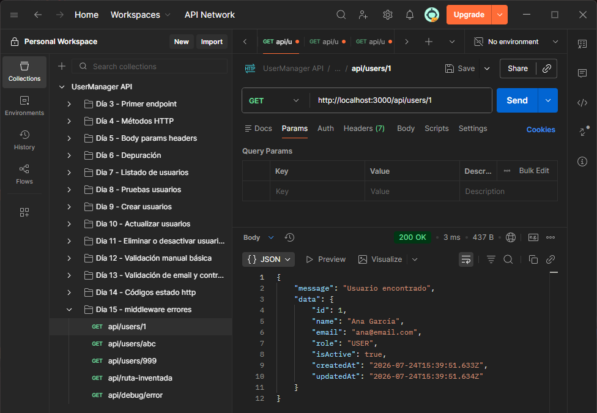
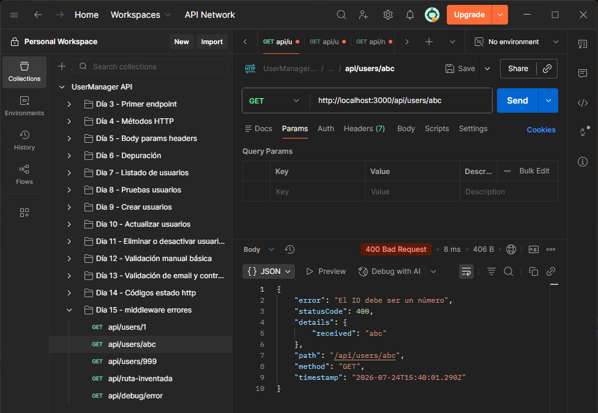
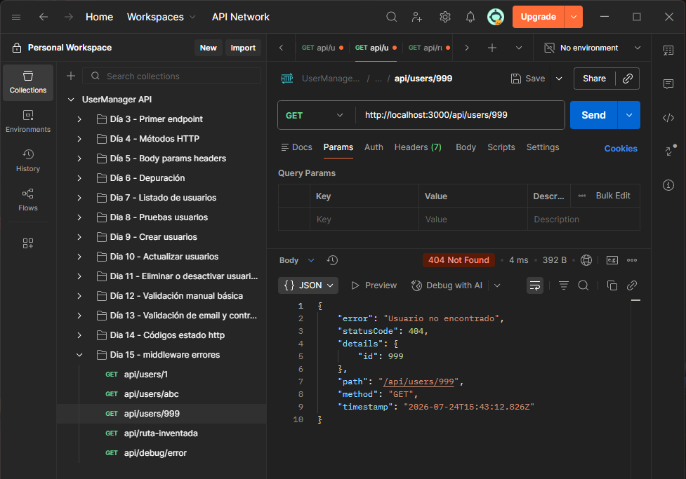
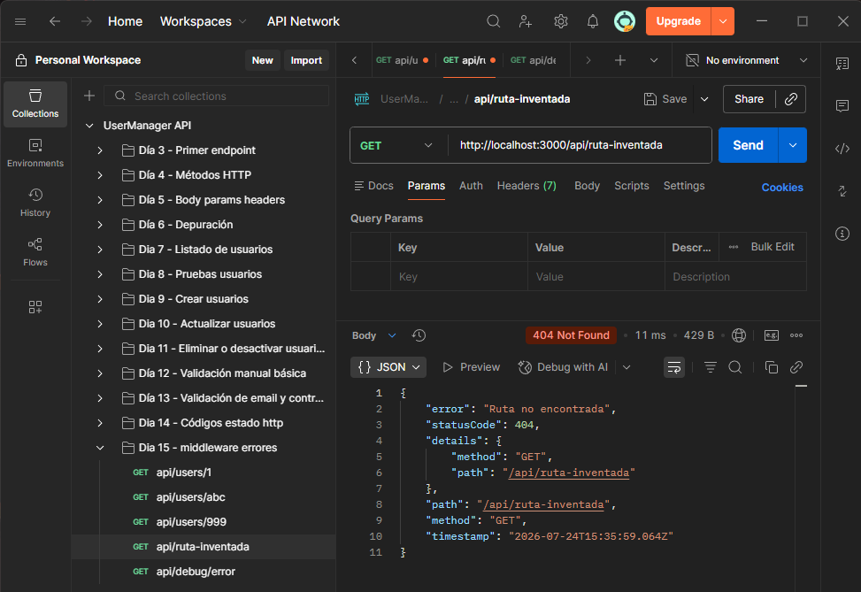
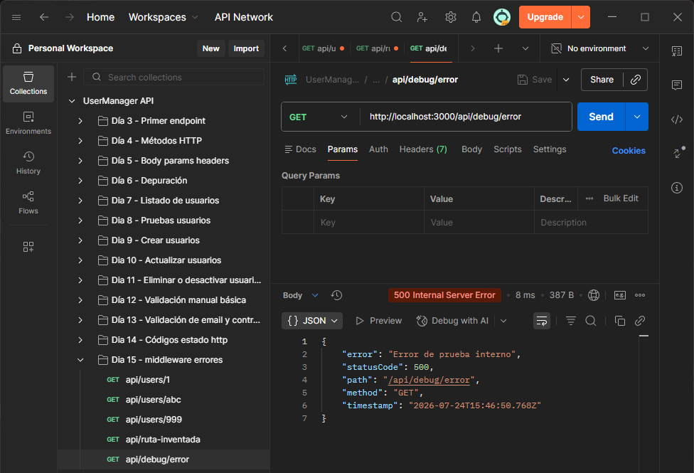

# Día 15 - Middleware centralizado de errores

## Qué he hecho

- He aprendido qué es un middleware.
- He aprendido para qué sirve `next()`.
- He creado una clase `AppError`.
- He creado un middleware para rutas no encontradas.
- He creado un middleware global de errores.
- He adaptado `GET /api/users/:id` para usar `next(new AppError(...))`.
- He probado errores `400`, `404` y `500`.
- He comprobado que los errores tienen un formato común.

## Clase AppError

```ts
class AppError extends Error {
  statusCode: number;
  details?: unknown;

  constructor(message: string, statusCode: number = 500, details?: unknown) {
    super(message);
    this.statusCode = statusCode;
    this.details = details;
  }
}
```

## Formato de error

```json
{
  "error": "Mensaje del error",
  "statusCode": 400,
  "details": {},
  "path": "/api/users/abc",
  "method": "GET",
  "timestamp": "..."
}
```

## Casos probados

| Petición | Caso | Código esperado | Resultado |
| --- | --- | ---: | --- |
| `GET /api/users/1` | Usuario existente | 200 |  |
| `GET /api/users/abc` | ID no válido | 400 |  |
| `GET /api/users/999` | Usuario no encontrado | 404 |  |
| `GET /api/ruta-inventada` | Ruta inexistente | 404 |  |
| `GET /api/debug/error` | Error interno de prueba | 500 |  |

## Explicación personal

Un middleware de errores permite centralizar la forma en que la API responde
cuando ocurre un problema. Así evitamos que cada ruta devuelva errores con
formatos diferentes.