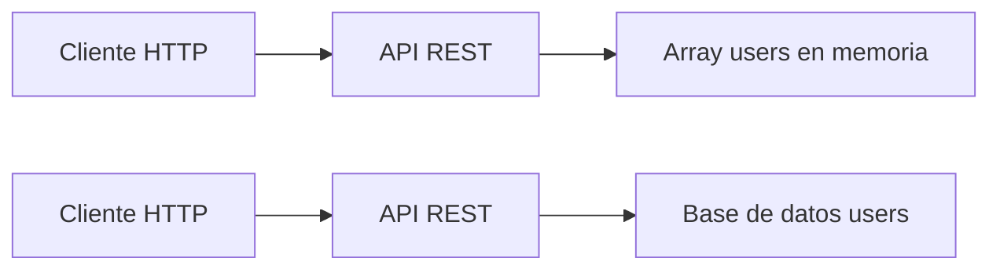

# Día 16 - Base de datos y persistencia

## Qué he hecho

- He comprobado que los datos en memoria se pierden al reiniciar el servidor.
- He entendido qué significa persistencia.
- He comparado datos en memoria y base de datos.
- He diseñado la tabla users.
- He definido campos, tipos conceptuales y restricciones.
- He escrito una propuesta SQL conceptual.
- He explicado cómo cambiará la arquitectura del proyecto.

## Problema detectado

Al crear un usuario en memoria y reiniciar el servidor, el usuario desaparece.

Esto ocurre porque los datos están guardados dentro del proceso de Node.js y no en una base de datos persistente.

## Diseño de la tabla users

| Campo TypeScript | Campo en base de datos | Tipo conceptual | Descripción |
| --- | --- | --- | --- |
| `id` | `id` | número | Identificador único |
| `name` | `name` | texto | Nombre del usuario |
| `email` | `email` | texto | Email único |
| `passwordHash` | `password_hash` | texto | Contraseña hasheada |
| `role` | `role` | texto | USER o ADMIN |
| `isActive` | `is_active` | booleano | Estado del usuario |
| `createdAt` | `created_at` | fecha | Fecha de creación |
| `updatedAt` | `updated_at` | fecha | Fecha de modificación |

## Definir restricciones

| Campo | Restricción | Motivo |
| :--- | :--- | :--- |
| `id` | PRIMARY KEY | Identifica cada usuario |
| `name` | NOT NULL | Todo usuario debe tener nombre |
| `email` | NOT NULL, UNIQUE | Todo usuario debe tener email y no se puede repetir |
| `password_hash` | NOT NULL | Todo usuario necesita credenciales |
| `role` | NOT NULL | Todo usuario debe tener un rol |
| `is_active` | NOT NULL, DEFAULT true | Todo usuario debe tener estado |
| `created_at` | NOT NULL | Debe registrarse cuándo se creó |
| `updated_at` | NOT NULL | Debe registrarse cuándo se modificó |

## Dibujar el cambio de arquitectura




## Propuesta SQL conceptual

```sql
CREATE TABLE users (
  id SERIAL PRIMARY KEY,
  name VARCHAR(100) NOT NULL,
  email VARCHAR(150) NOT NULL UNIQUE,
  password_hash VARCHAR(255) NOT NULL,
  role VARCHAR(20) NOT NULL,
  is_active BOOLEAN NOT NULL DEFAULT true,
  created_at TIMESTAMP NOT NULL DEFAULT CURRENT_TIMESTAMP,
  updated_at TIMESTAMP NOT NULL DEFAULT CURRENT_TIMESTAMP
);
```

## Explicación personal

Necesitamos una base de datos porque los datos en memoria se pierden cuando se reinicia el servidor. Una base de datos permite guardar la información de forma persistente y recuperarla más adelante.