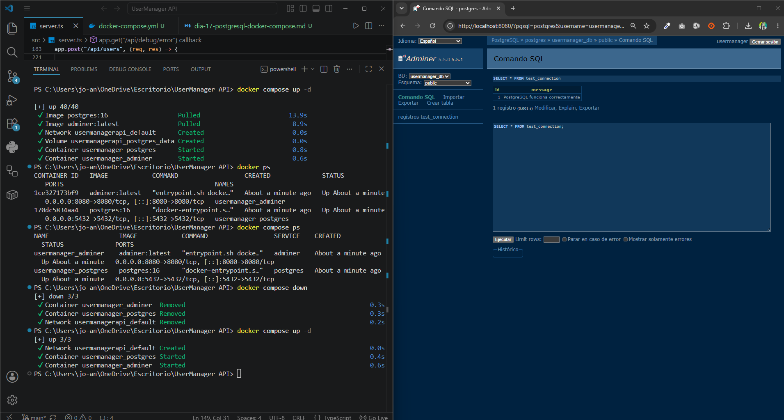

# Día 17 - PostgreSQL con Docker Compose

## Qué he hecho

- He comprobado que Docker está instalado.
- He creado un archivo `docker-compose.yml`.
- He levantado un servicio PostgreSQL.
- He levantado un servicio Adminer.
- He accedido a Adminer desde el navegador.
- He creado una tabla de prueba.
- He insertado un dato de prueba.
- He comprobado la persistencia usando un volumen.

## Servicios creados

| Servicio | Imagen | Puerto | Función |
| --- | --- | --- | --- | 
| postgres | postgres:16 | 5432 | Base de datos PostgreSQL |
| adminer | adminer:latest | 8080 | Interfaz web para consultar la base de datos |

## Datos de conexión

| Campo | Valor |
| --- | --- |
| Sistema | PostgreSQL | 
| Servidor | postgres |
| Usuario | usermanager |
| Contraseña | usermanager_password |
| Base de datos | usermanager_db |

## Comandos usados

```bash
docker compose up -d
docker ps
docker compose ps
docker compose down
```

## Prueba de conexión

```sql
CREATE TABLE test_connection (
  id SERIAL PRIMARY KEY,
  message VARCHAR(100) NOT NULL
);

INSERT INTO test_connection (message)
VALUES ('PostgreSQL funciona correctamente');

SELECT * FROM test_connection;
```

  

## Explicación personal

Docker Compose permite levantar la base de datos y otras herramientas necesarias usando un único archivo de configuración. Gracias al volumen, los datos de PostgreSQL se conservan aunque paremos y volvamos a arrancar los contenedores.