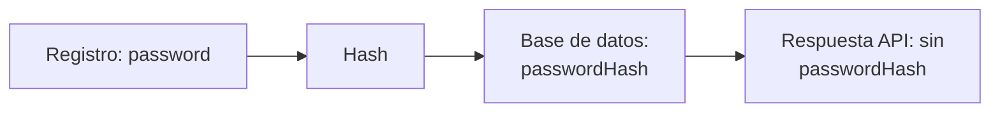

# Día 18 - Diseño del modelo persistente User

## Qué he hecho

- He analizado qué datos necesita guardar un usuario.
- He diferenciado entre usuario en memoria y usuario persistente.
- He definido los campos principales del modelo User.
- He identificado qué campos son obligatorios.
- He identificado qué campos deben ser únicos.
- He marcado passwordHash como dato sensible.
- He definido las reglas de role e isActive.
- He preparado el diseño para convertirlo más adelante en un modelo Prisma.

## Campos del modelo User

| Campo | Tipo conceptual | Obligatorio | Único | Valor por defecto | Se devuelve al cliente |
|---|---|---|---|---|---|
| `id` | número | sí | sí | automático | sí |
| `name` | texto | sí | no | no | sí |
| `email` | texto | sí | sí | no | sí |
| `passwordHash` | texto | sí | no | no | no |
| `role` | `USER` / `ADMIN` | sí | no | `USER` | sí |
| `isActive` | booleano | sí | no | `true` | sí |
| `createdAt` | fecha | sí | no | automático | sí |
| `updatedAt` | fecha | sí | no | automático | sí |

## Reglas del modelo

- El email no se puede repetir.
- El email debe guardarse normalizado.
- La contraseña nunca se guarda en texto plano.
- `passwordHash` nunca se devuelve al cliente.
- Todo usuario tiene un rol.
- El rol por defecto es `USER`.
- Todo usuario se crea activo.
- Un usuario desactivado no puede iniciar sesión.
- `createdAt` se genera al crear el usuario.
- `updatedAt` cambia cuando el usuario se modifica.

## Entrada, persistencia y salida

| Representación | Qué significa | Contiene password | Contiene passwordHash |
|---|---|---|---|
| Entrada | Datos que envía el cliente | sí | no |
| Persistencia | Datos guardados en base de datos | no | sí |
| Salida | Datos que devuelve la API | no | no |

### Ejemplo de entrada

```json
{
  "name": "Ana García",
  "email": "ana@email.com",
  "password": "123456"
}
```

### Ejemplo de salida

```json
{
  "id": 1,
  "name": "Ana García",
  "email": "ana@email.com",
  "role": "USER",
  "isActive": true,
  "createdAt": "...",
  "updatedAt": "..."
}
```

## Posible modelo Prisma futuro

```prisma
model User {
  id           Int      @id @default(autoincrement())
  name         String
  email        String   @unique
  passwordHash String
  role         Role     @default(USER)
  isActive     Boolean  @default(true)
  createdAt    DateTime @default(now())
  updatedAt    DateTime @updatedAt
}

enum Role {
  USER
  ADMIN
}
```

Este modelo todavía no se implementa hoy. Servirá como referencia para los próximos días.



La contraseña llega desde el cliente solo durante el registro o login. Después se transforma en un hash y se guarda como passwordHash. La API nunca debe devolver password ni passwordHash.