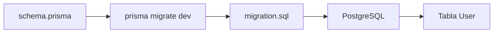

# Día 22 - Primera migración con Prisma

## Qué he hecho

- He revisado que PostgreSQL esté arrancado.
- He comprobado la variable DATABASE_URL.
- He validado el archivo schema.prisma.
- He ejecutado la primera migración con Prisma.
- He creado la carpeta prisma/migrations.
- He revisado el archivo migration.sql.
- He comprobado que existe la tabla User.
- He comprobado que existe la tabla _prisma_migrations.
- He entendido la diferencia entre modelo, migración y tabla.

## Comando principal

```bash
npx prisma migrate dev --name init
```

## Archivos generados

```text
prisma/migrations/
  <timestamp>_init/
    migration.sql
```

## Tablas creadas

```text
User
_prisma_migrations
```

## Campos de la tabla User

```text
id
name
email
passwordHash
role
isActive
createdAt
updatedAt
```

## Explicación personal

La migración convierte el modelo User de schema.prisma en una tabla real dentro de PostgreSQL. A partir de ahora la estructura de la base de datos queda versionada en el repositorio.

## Modelo, migración y tabla

| Concepto | Dónde está | Para qué sirve |
|---|---|---|
| Modelo | prisma/schema.prisma | Define cómo queremos que sea la estructura |
| Migración | prisma/migrations/.../migration.sql | Guarda el cambio generado |
| Tabla | PostgreSQL | Almacena los datos reales |

## Qué hace prisma migrate dev

El comando `prisma migrate dev` lee el archivo schema.prisma, detecta cambios en el modelo, genera una migración SQL, la aplica sobre la base de datos de desarrollo y actualiza el historial de migraciones.

