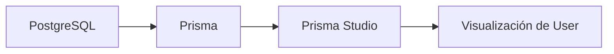
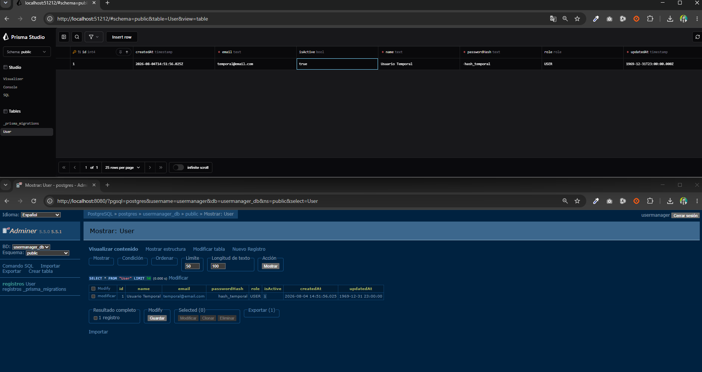
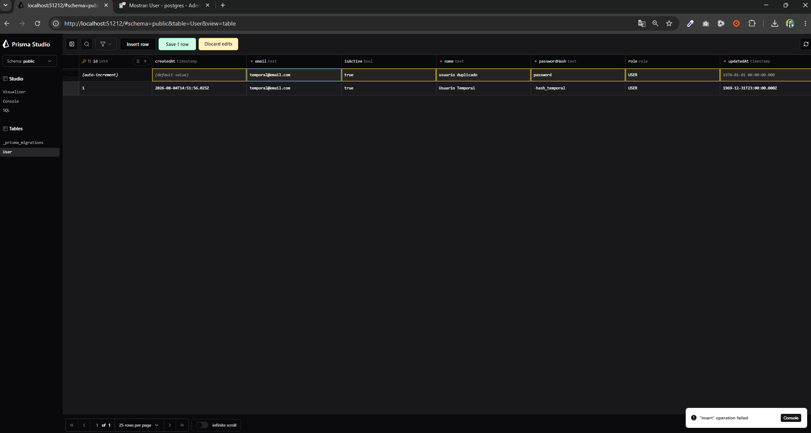

# Día 23 - Prisma Studio

## Qué he hecho

- He arrancado PostgreSQL con Docker Compose.
- He comprobado que existe la migración inicial.
- He ejecutado Prisma Studio.
- He abierto la tabla User.
- He revisado las columnas del modelo.
- He comprobado visualmente los campos id, name, email, passwordHash, role, isActive, createdAt y updatedAt.
- He creado un usuario temporal.
- He comprobado valores automáticos.
- He probado la restricción de email único.
- He probado el enum Role.
- He modificado isActive.
- He eliminado el usuario temporal.

## Comando usado

```bash
npx prisma studio
```

O mediante script:

```bash
npm run prisma:studio
```

## URL habitual

```text
http://localhost:5555
```

## Tabla revisada

```text
User
```

## Campos observados

```text
id
name
email
passwordHash
role
isActive
createdAt
updatedAt
```

## Diferencia entre migración y seed

| Concepto | Qué hace |
|---|---|
| Migración | Crea o modifica la estructura de la base de datos |
| Seed | Inserta datos iniciales |

## Explicación personal

Prisma Studio es una herramienta visual que permite ver y editar los datos de la base de datos. Me ayuda a comprobar que la migración ha creado correctamente la tabla User y que las restricciones del modelo funcionan.

## Prisma Studio frente a Adminer

| Herramienta | Para qué sirve |
|---|---|
| Adminer | Gestionar la base de datos de forma general |
| Prisma Studio | Ver y editar datos desde el modelo Prisma |

Adminer muestra la base de datos desde un punto de vista más general. Prisma Studio está más integrado con el proyecto Prisma.



Prisma Studio se conecta a la base de datos usando la configuración de Prisma y permite visualizar los modelos como tablas editables.

## Comprobación ejercicio

Creación de usuario:

 

Creación de usuario duplicado:

 