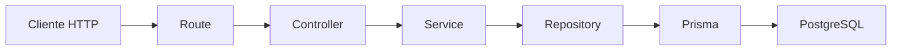
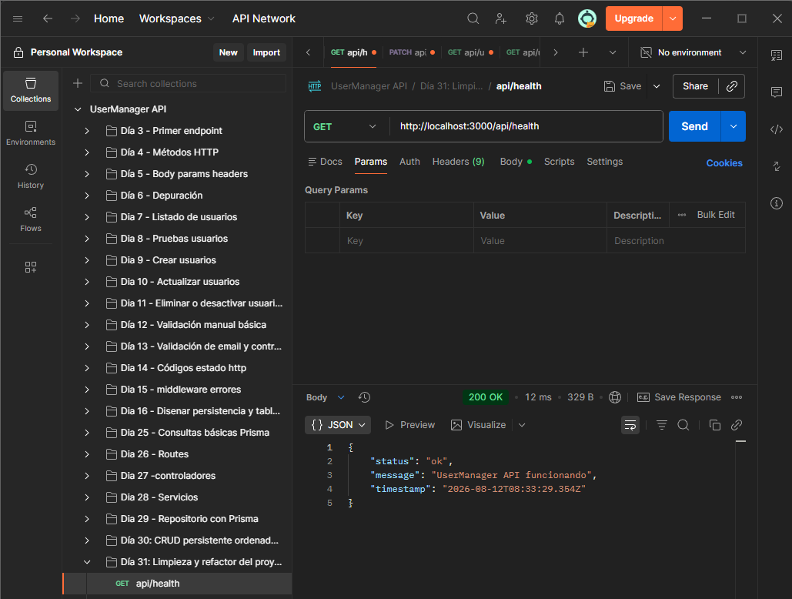
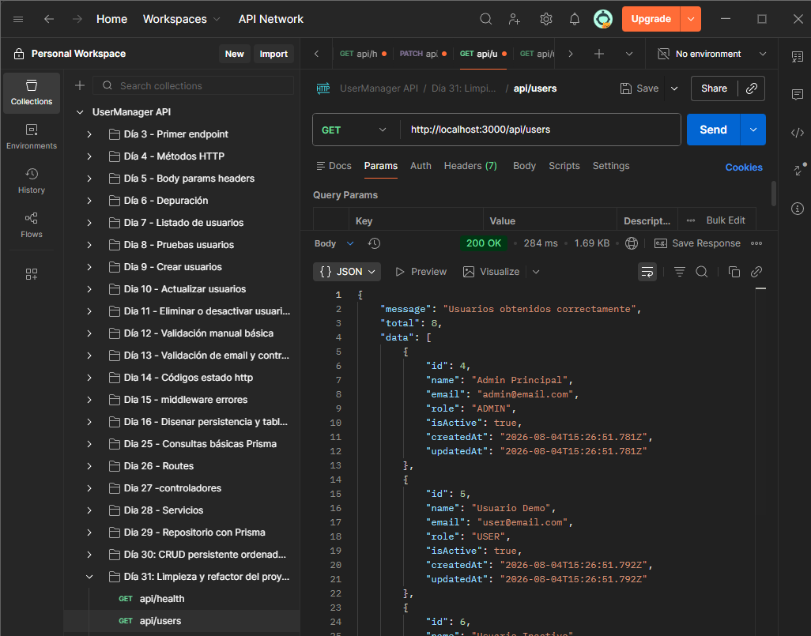
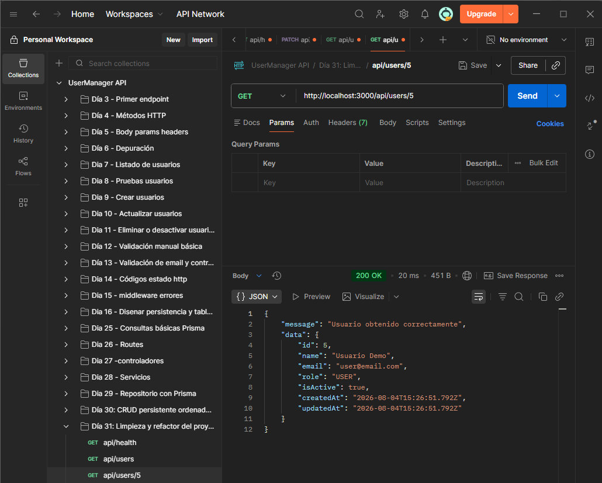
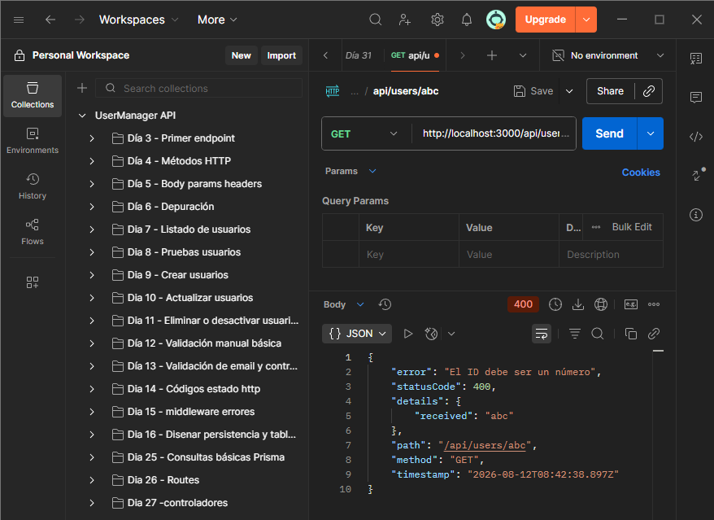
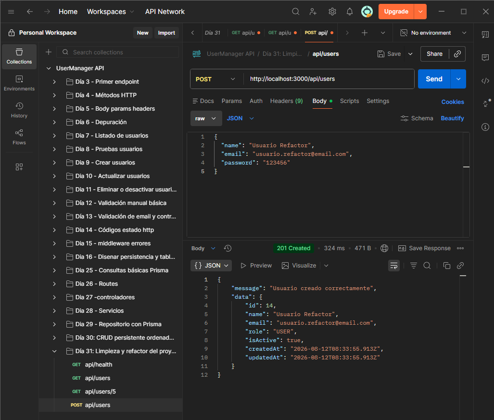
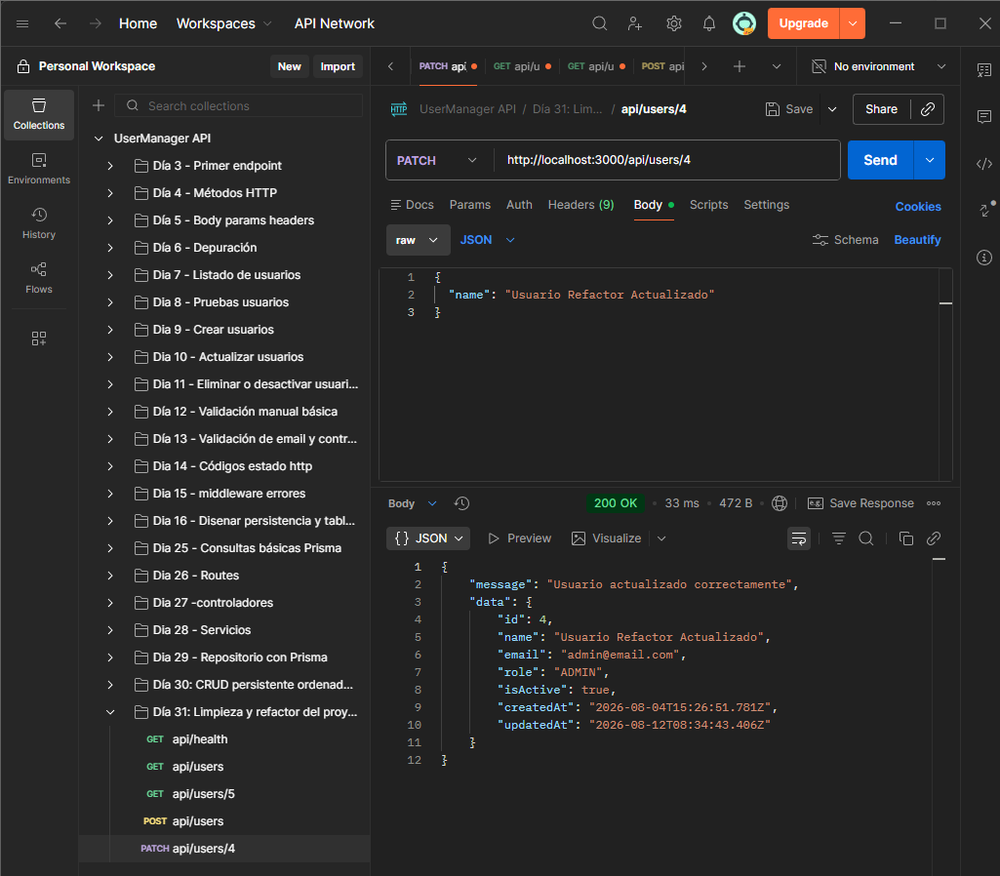
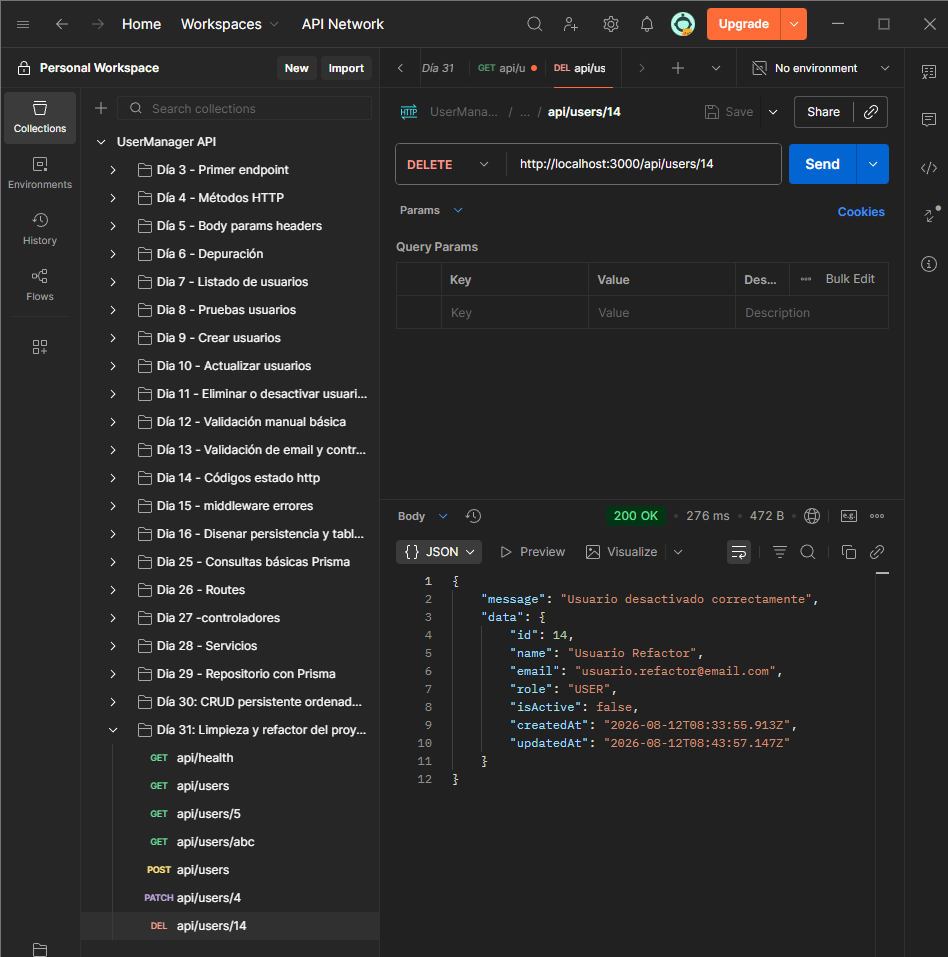
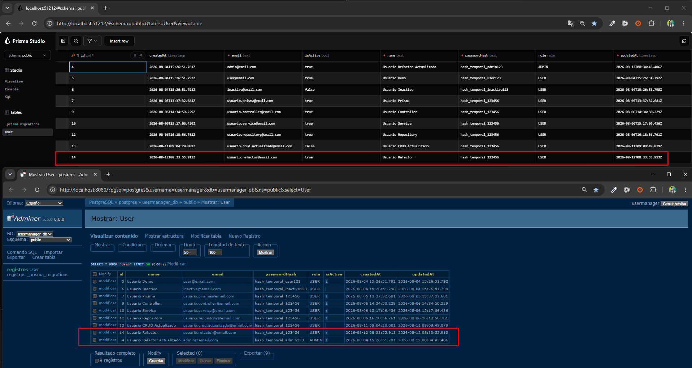

# Día 31 - Limpieza y refactor

## Qué he hecho

- He revisado el proyecto después de crear el CRUD persistente.
- He eliminado o apartado rutas temporales de debug.
- He limpiado server.ts.
- He revisado user.routes.ts.
- He limpiado user.controller.ts.
- He revisado user.service.ts.
- He revisado user.repository.ts.
- He creado utilidades reutilizables.
- He creado parse.utils.ts.
- He creado string.utils.ts.
- He eliminado imports innecesarios.
- He comprobado que las rutas principales siguen funcionando.
- He ejecutado npm run build.
- He actualizado el README.

## Estructura después del refactor

```text
src/
  prisma.ts
  server.ts
  controllers/
    health.controller.ts
    user.controller.ts
  errors/
    AppError.ts
  repositories/
    user.repository.ts
  routes/
    health.routes.ts
    user.routes.ts
  services/
    user.service.ts
  utils/
    parse.utils.ts
    string.utils.ts
```

## Rutas principales

| Método | Ruta | Acción |
| --- | --- |---|
| GET | `/api/health` | Estado de la API |
| GET | `/api/users` | Listar usuarios |
| GET | `/api/users/:id` | Consultar usuario |
| POST | `/api/users` | Crear usuario |
| PATCH | `/api/users/:id` | Actualizar usuario |
| DELETE | `/api/users/:id` | Desactivar usuario |

## Cambios de refactor

| Antes | Después |
| --- | --- |
| Rutas temporales de debug | Rutas reales `/api/users` |
| Parseo de ID repetido | `parseIdParam` |
| Funciones de string dentro del servicio | `string.utils.ts` |
| Imports no usados | Imports limpiados |
| README desactualizado | README actualizado |

## Flujo actual

```text
Route → Controller → Service → Repository → Prisma → PostgreSQL
```

## Explicación personal

Refactorizar permite mejorar la estructura del código sin cambiar el comportamiento externo de la API. Después de este día, el proyecto queda más limpio y preparado para empezar la fase de seguridad.



## Checklist de pruebas después del refactor

| Prueba | Resultado |
| --- | --- |
| `GET /api/health` |  |
| `GET /api/users` |  |
| `GET /api/users/1` |  |
| `GET /api/users/abc` |  |
| `POST /api/users` |  |
| `PATCH /api/users/:id` |  |
| `DELETE /api/users/:id` |  |

Comprobación en Prisma y Posgres:
 