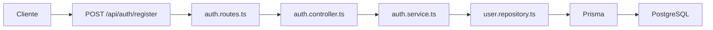
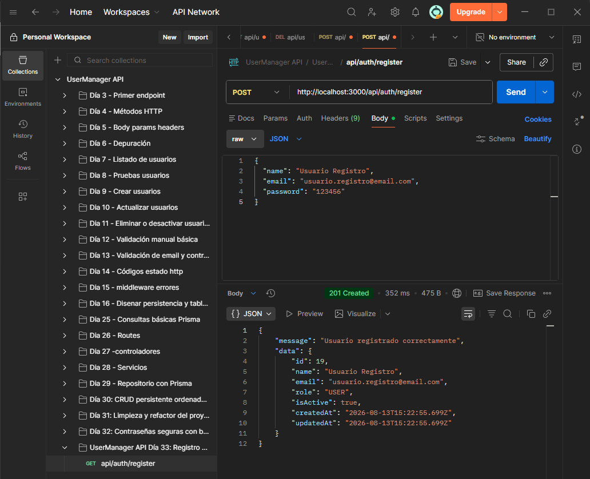
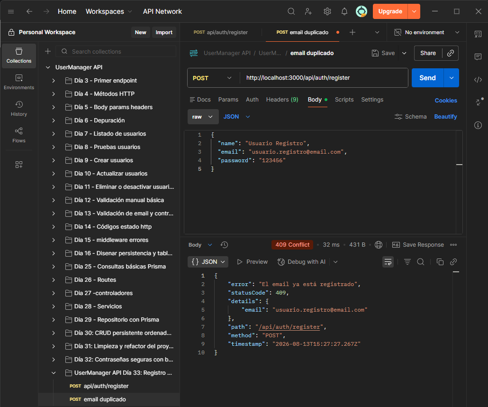
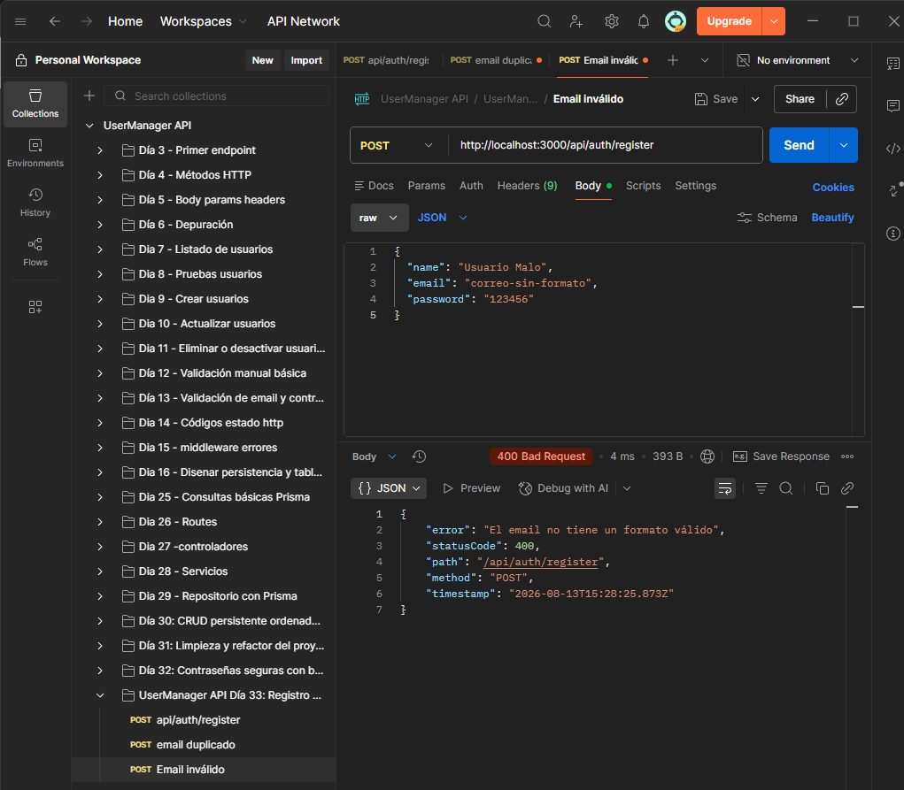
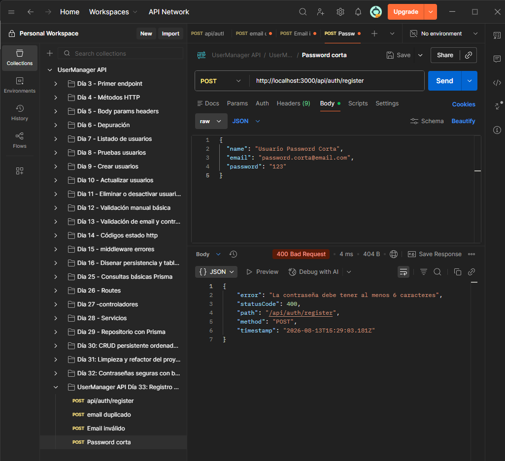
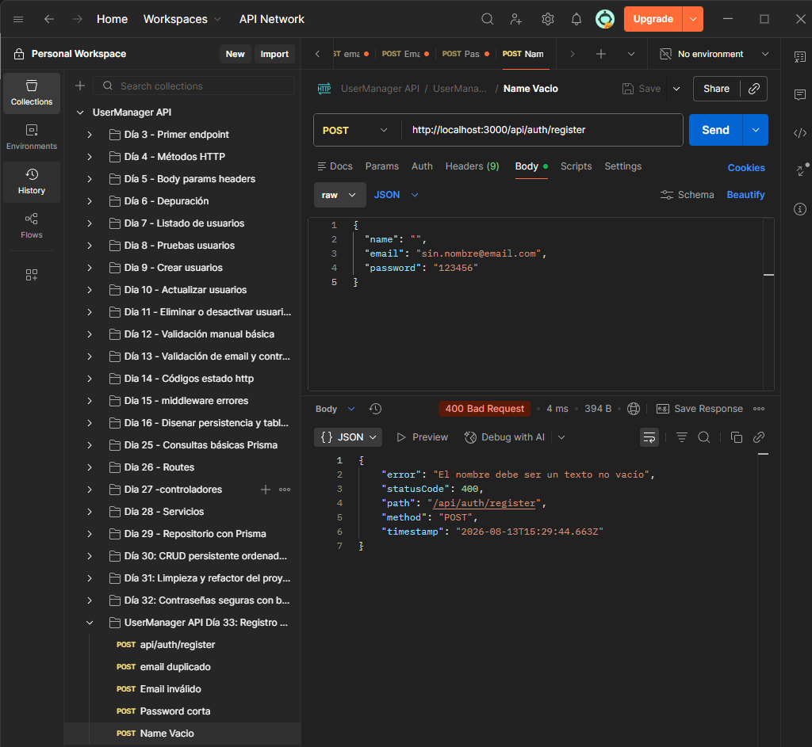
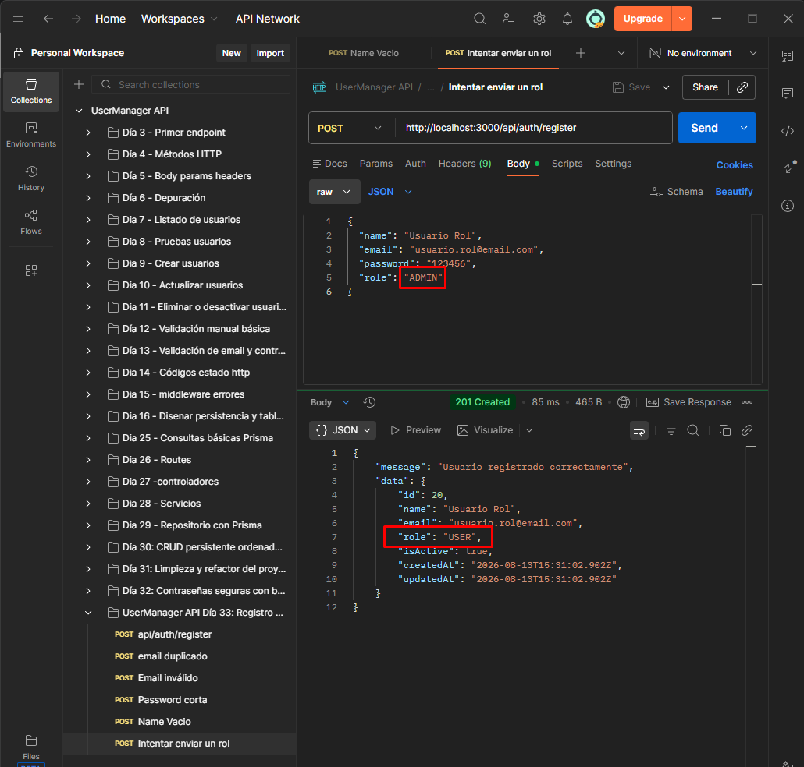
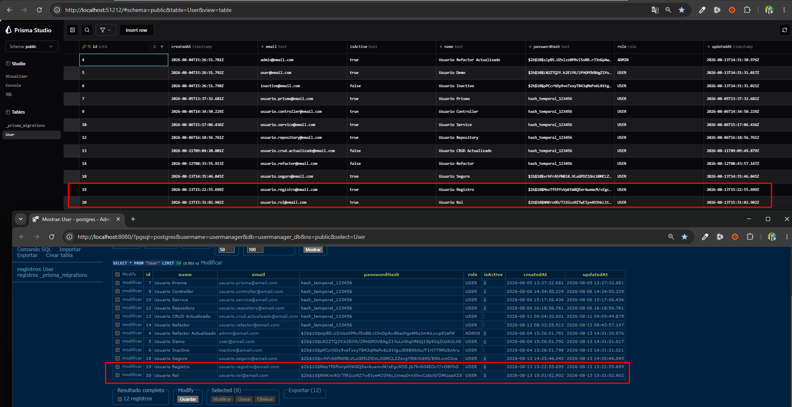

# Día 33 - Registro de usuarios

## Qué he hecho

- He creado auth.service.ts.
- He creado registerService.
- He creado auth.controller.ts.
- He creado registerController.
- He creado auth.routes.ts.
- He montado authRouter en server.ts.
- He creado el endpoint POST /api/auth/register.
- He validado name, email y password.
- He comprobado email duplicado.
- He usado bcrypt mediante hashPassword.
- He comprobado que el usuario se crea como USER.
- He comprobado que el usuario se crea activo.
- He comprobado que passwordHash no se devuelve al cliente.
- He probado errores de validación.
- He ejecutado npm run build.

## Endpoint creado

```text
POST /api/auth/register
```

## Body esperado

```json
{
  "name": "Usuario Nuevo",
  "email": "nuevo@email.com",
  "password": "123456"
}
```

## Respuesta correcta

```text
201 Created
```

## Reglas del registro

```text
name es obligatorio.
email es obligatorio.
password es obligatorio.
email debe tener formato válido.
password debe tener al menos 6 caracteres.
email no puede estar repetido.
password se guarda como passwordHash.
role se asigna como USER por defecto.
isActive se asigna como true por defecto.
passwordHash nunca se devuelve.
```

## Archivos creados

```text
src/routes/auth.routes.ts
src/controllers/auth.controller.ts
src/services/auth.service.ts
```

## Flujo del registro

```text
Route → Controller → Service → Repository → Prisma → PostgreSQL
```

## Diferencia entre endpoints

| Endpoint | Uso |
| --- | --- |
| `POST /api/auth/register` | Registro público de usuarios |
| `POST /api/users` | Creación de usuarios desde gestión interna |

## Explicación personal

El registro permite que un usuario cree su propia cuenta. La contraseña no se guarda en texto plano, sino que se transforma en passwordHash usando bcrypt antes de guardarse en PostgreSQL.



## Checklist de pruebas

| Prueba | Resultado |
| --- | --- |
| `POST /api/auth/register` con datos correctos |  |
| Registro con email duplicado |  |
| Registro con email inválido |  |
| Registro con password corta |  |
| Registro con name vacío |  |
| Intento de enviar `role: ADMIN` |  |
| Prisma Studio muestra `role: USER` | |
| Prisma Studio muestra `isActive: true` | |
| Prisma Studio muestra `passwordHash` con bcrypt | |
| La respuesta no devuelve `passwordHash` | |
| `npm run build` funciona | |

Comprobación de Prisma y Postgre:
 