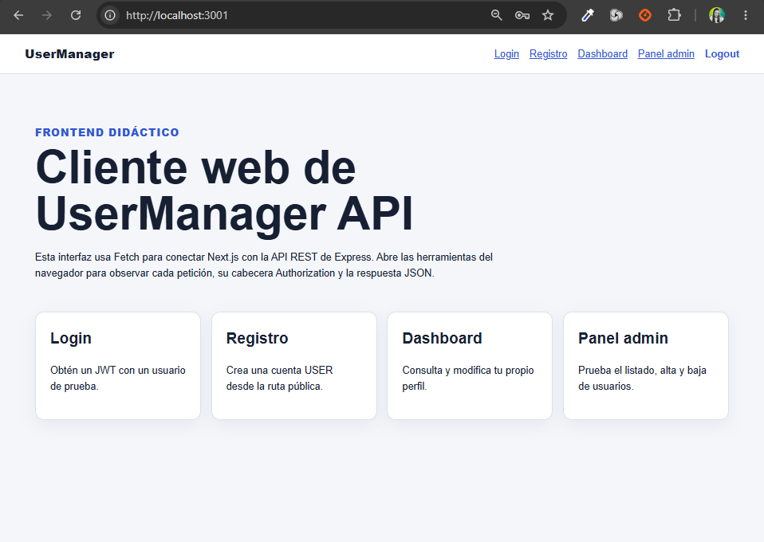
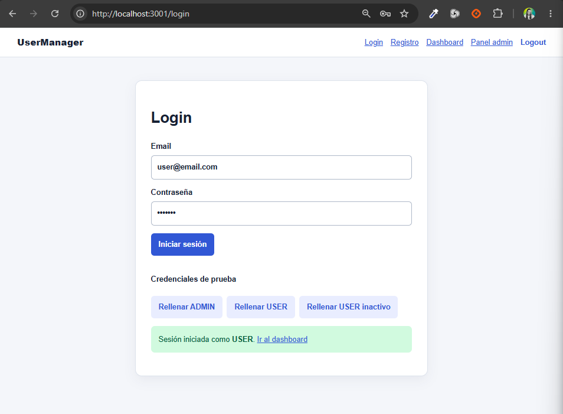
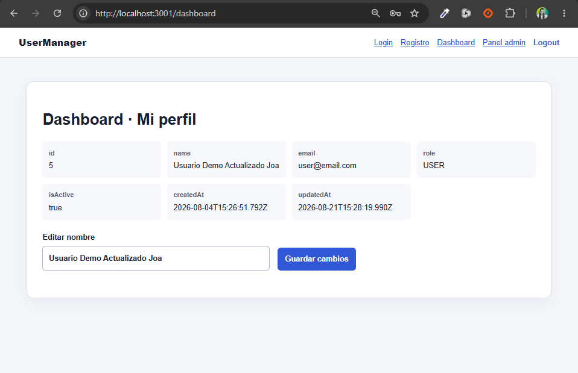
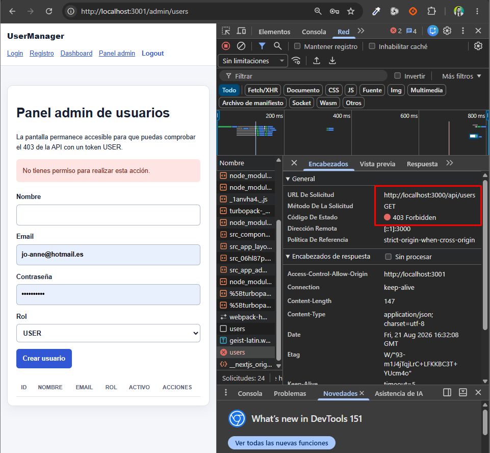
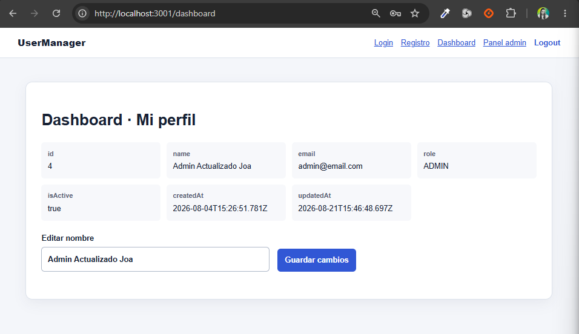
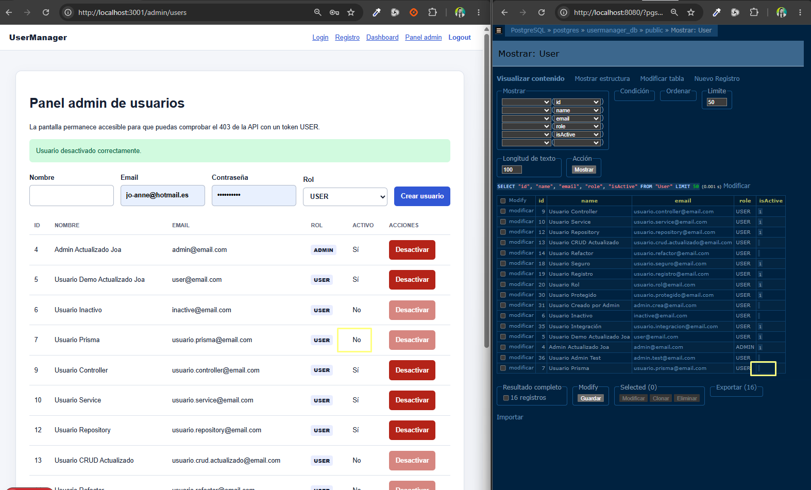
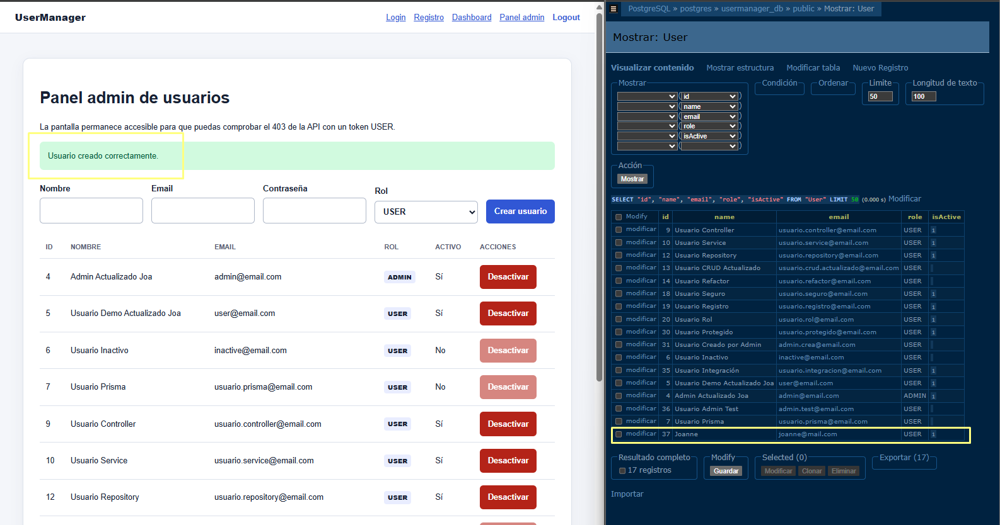
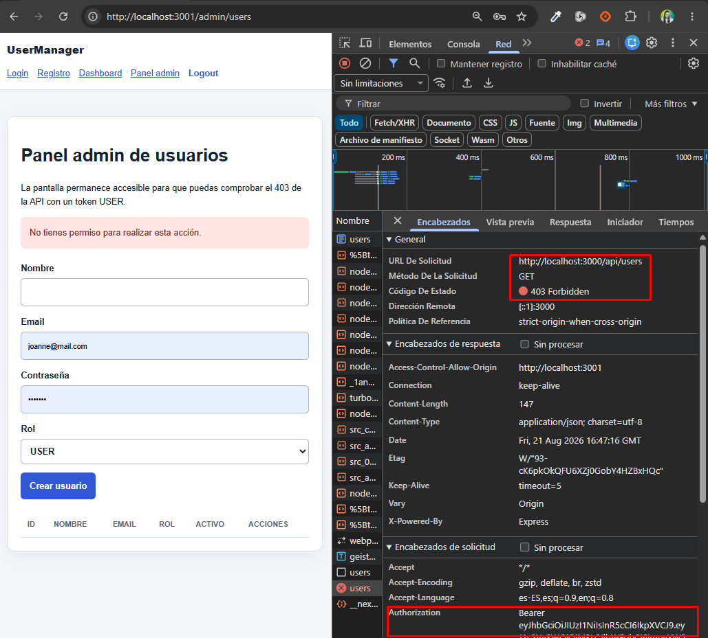

# Día 40 - Revisión final y cierre del proyecto

En este último día hemos realizado una auditoría completa del proyecto para validar que todas las piezas encajan, la arquitectura es sólida y la integración extremo a extremo funciona sin fisuras.

## ¿Qué hemos construido y validado?

* **Arquitectura limpia y modular:** Separamos responsabilidades de forma estricta en Express utilizando controladores, servicios de lógica de negocio, middlewares e interacción con datos mediante repositorios.

* **Persistencia tipada con Prisma y PostgreSQL:** Configuramos la base de datos contenerizada con Docker Compose, ejecutamos migraciones y creamos un seed idempotente para pruebas.

* **Seguridad y Control de Acceso:** 
  * Hashing seguro de contraseñas con `bcrypt`.
  * Autenticación basada en tokens `JWT`.
  * Middlewares para protección de rutas (`authMiddleware`) y autorización granular basada en roles (`roleMiddleware` para `ADMIN` y `USER`).

* **Conexión Frontend-Backend:** Integramos la API con un cliente en Next.js, configurando CORS y validando el flujo completo de autenticación, edición de perfil y gestión de usuarios.

| Check | Backend | Check | Frontend |
| :---: | :--- | :---: | :--- |
| ✅ | PostgreSQL arranca con Docker Compose. | ✅ | Existe `frontend/.env.local`. |
| ✅ | `npm run prisma:generate` termina correctamente. | ✅ | `npm run build` compila. |
| ✅ | El seed puede ejecutarse más de una vez sin duplicar datos. | ✅ | Registro y login muestran errores legibles. |
| ✅ | `npm run build` compila. | ✅ | El JWT se guarda y se envía en `Authorization`. |
| ✅ | Los errores usan códigos HTTP coherentes. | ✅ | Dashboard consulta y edita el perfil. |
| ✅ | `passwordHash` nunca aparece en respuestas. | ✅ | USER recibe 403 en el panel admin. |
| ✅ | Las rutas públicas, autenticadas y ADMIN tienen sus middlewares. | ✅ | ADMIN lista, crea y desactiva usuarios. |
| ✅ | CORS permite `http://localhost:3001`. | ✅ | Logout elimina el estado local. |
| ✅ | La documentación menciona Prisma 7, el cliente generado y PrismaPg. | ✅ | La interfaz se puede usar en móvil y escritorio. |

---

# DEMO FINAL DEL PROYECTO

### 1. Arrancar PostgreSQL
Levantamos el contenedor de la base de datos en segundo plano:
```bash
docker compose up -d
```

### 2. Ejecutar el Seed
Poblamos la base de datos con los datos iniciales de prueba (usuarios por defecto):
```bash
npm run prisma:seed
```

### 3. Iniciar Backend y Frontend
En dos terminales independientes, ejecutamos el servidor de desarrollo:

* **Backend (`/UserManagerAPI`):**
  ```bash
  npm run dev
  ```
* **Frontend (`/UserManagerAPI_Frontend`):**
  ```bash
  npm run dev
  ```

# Comprobaciones

## 1. Inicio del frontend
 

## 2. Login correcto como USER
 

## 3. Dashboard con el perfil
 

## 4. Respuesta 403 del panel admin con USER
 

## 5. Tabla de usuarios con ADMIN
 

## 6. Desactivación de un usuario
 

## 7. Creación de un usuario
 

## 8. Intentar entrar al panel admin y comprobar 403
 

---

## Conclusión personal y agradecimientos

Este reto ha supuesto un salto enorme en mi formación, permitiéndome llevar una API desde una estructura base en Express hasta una arquitectura profesional, escalable y segura, con persistencia en PostgreSQL mediante Prisma, autenticación JWT, control de acceso por roles y TypeScript estricto.

Todo este desarrollo ha sido monitorizado e impulsado por nuestro profesor de DAM, [Jordi Cidoncha](https://www.linkedin.com/in/jordicido/), a quien quiero agradecer enormemente su dedicación y apoyo constante, guiándonos y resolviendo dudas incluso fuera del horario de clases (especialmente durante este verano, donde nos ha ido poniendo el reto cada dia a las 7.00 de la mañana 🫶) para ayudarnos a construir proyectos sólidos y cercanos al mundo laboral real.